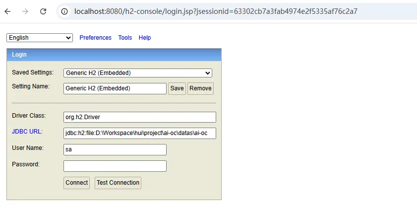

# datas

## 数据库

dev开发环境，使用h2作为数据库， 对应的 `ai-oc.mv.db` 为我们默认提供的已经完成字典初始化/测试账号集成的数据库

### 1.数据库访问

本地dev开发时，通过访问 [http://localhost:8080/h2-console](http://localhost:8080/h2-console) 进入管理控制台

注意，使用你项目的路径地址，替换下图输入框中的 `JDBC URL`

- 如我的工程目录为： `D:\Workspace\hui\project\ai-oc`
- 那么输入框中的 `JDBC URL` 为： `jdbc:h2:file:D:/Workspace/hui/project/ai-oc/ai-oc.mv.db`

### 2.本地开发

在本地开发时，强烈建议，基于默认的 ai-oc.mv.db 拷贝一份业务数据库，然后后续的业务操作在这个变更后的业务数据库上进行，避免后续代码同步时出现冲突

最佳实践方案：

1. 拷贝 `ai-oc.mv.db` 为 `ai-oc-my-mv.db`
2. 修改配置文件 `dev/application-oc.yml` 下的配置 `oc.database.name` = `ai-oc-my`
3. 或者修改启动参数，`--oc-database-name=ai-oc-my`
