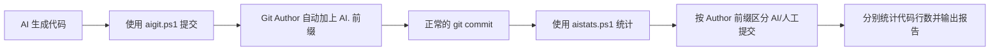

# 大模型应用开发：用 Git 元数据实现 AI 代码生成量统计

> 你的项目里，AI 到底写了多少代码？占总代码量的百分之几？是 30% 还是 80%？
>
> 本文将手把手教你，用 **Git 提交者前缀 + PowerShell 脚本**，零依赖地统计项目中 AI 代码的生成量。不需要任何第三方工具，不需要数据库，不需要埋点，纯粹靠 Git 元数据就能做到。

---

## 一、为什么要统计 AI 代码量？

当你开始在日常开发中大量使用 AI 辅助编码（VibeCoding、Cursor、Copilot 等），一个自然的问题就出现了：

**AI 到底帮我写了多少代码？**

这不仅仅是一个好奇心驱动的问题，它背后有几个实际的考量：

| 考量维度 | 具体问题 |
|---------|---------|
| 效率评估 | AI 辅助后，我的编码效率提升了多少？ |
| 质量风险 | AI 生成的代码占比越高，潜在的"黑盒"风险越大，Review 压力也越大 |
| 团队汇报 | 怎么量化地向团队/领导说明 AI 辅助开发的效果？ |
| 简历亮点 | "项目中 AI 代码生成占比 XX%"——这比"用了 AI 辅助开发"有说服力多了 |

> 对求职派来说，这个统计还有一个额外的意义：**作为 AI 大模型应用开发者，如果你的项目本身就有大量 AI 生成的代码，这本身就是一个很好的面试素材。**

---

## 二、方案设计：基于 Git Author 前缀的标记法

### 2.1 核心思路

方案的核心思路极其简单：

> **在 AI 提交代码时，给 Git Author Name 加一个 `AI.` 前缀。统计时，通过前缀区分 AI 提交和人工提交，分别计算代码行数。**

就这么朴素。不需要修改 Git 底层，不需要任何插件，不需要 Hook。

### 2.2 整体流程



### 2.3 为什么选择 Author Name 而不是其他方案？

| 方案 | 优点 | 缺点 |
|------|------|------|
| **Author Name 前缀（我们选的）** | 零依赖，Git 原生支持，可追溯 | 需要提交时用专用脚本 |
| Commit Message 标记 | 简单 | 容易遗漏，格式不统一 |
| Git Notes | 不改历史 | 不是所有平台都支持 |
| 外部数据库记录 | 灵活 | 重依赖，维护成本高 |

Author Name 是 Git 的一等公民字段，每个 commit 都有，任何 Git 客户端都能读到，而且 `git log`、`git shortlog` 等命令天然支持按 Author 过滤。**这是成本最低、兼容性最好的方案。**

---

## 三、脚本一：`aigit.ps1` —— AI 代码提交工具

在让 AI 提交代码时，我们需要一个工具来自动处理 Author 切换。这就是 `aigit.ps1` 的作用。

### 3.1 完整脚本

```powershell
# Git commit script for AI-generated content
# Usage: .\aigit.ps1 -c "your commit message"

param(
    [Parameter(Mandatory=$true)]
    [string]$c
)

# 获取当前 Git 用户名（UTF-8 编码）
$originalUserName = git config user.name
$originalUserName = [System.Text.Encoding]::UTF8.GetString(
    [System.Text.Encoding]::Default.GetBytes($originalUserName)
)

Write-Host "Current username: $originalUserName" -ForegroundColor Cyan

# 防止重复加前缀
if ($originalUserName -match "^AI\.") {
    Write-Host "Error: Current user is already AI user ($originalUserName)" -ForegroundColor Red
    exit 1
}

# 临时设置 AI. 前缀的用户名
$newUserName = "AI.$originalUserName"
Write-Host "Setting temp username to: $newUserName" -ForegroundColor Yellow
git config user.name $newUserName

# 执行 git add
git add .

# 拼接 Co-Authored-By 信息
$coAuthor = "Co-Authored-By: AI-Assistant"
$fullCommitMessage = "$c`n`n$coAuthor"

# 使用临时文件写入 commit message（避免 PowerShell 管道编码问题）
$tempFile = [System.IO.Path]::GetTempFileName()
[System.IO.File]::WriteAllText($tempFile, $fullCommitMessage,
    [System.Text.UTF8Encoding]::new($false))
git commit -F $tempFile --cleanup=strip
Remove-Item $tempFile -Force

# 立即恢复原始用户名
git config user.name $originalUserName
```

### 3.2 关键设计解读

#### 设计 1：临时切换，用完即还

脚本的核心逻辑是：**提交前改成 `AI.xxx`，提交后立刻改回来**。

```powershell
# 提交前
git config user.name "AI.一灰"

# 提交后立刻恢复
git config user.name "一灰"
```

这样做的目的是避免影响后续人工提交。你的人工 commit 不会意外被标记为 AI 提交。

#### 设计 2：防重复前缀

```powershell
if ($originalUserName -match "^AI\.") {
    Write-Host "Error: Current user is already AI user" -ForegroundColor Red
    exit 1
}
```

防止 `AI.AI.一灰` 这种嵌套前缀的出现。虽然概率不大，但防御性编程总没坏处。

#### 设计 3：Co-Authored-By 签名

```powershell
$coAuthor = "Co-Authored-By: AI-Assistant"
$fullCommitMessage = "$c`n`n$coAuthor"
```

除了 Author 前缀，commit message 中还附带了 `Co-Authored-By` 标记。这是一个双保险——即使 Author 被修改，commit message 中的标记依然存在。同时，这也遵循了 Git 社区对"协作提交"的惯例格式。

#### 设计 4：UTF-8 编码处理

```powershell
$originalUserName = [System.Text.Encoding]::UTF8.GetString(
    [System.Text.Encoding]::Default.GetBytes($originalUserName)
)
```

这一行看起来有点绕，但它解决的是一个实际的痛点：**Windows PowerShell 默认使用 GBK 编码，而 Git config 存储的是 UTF-8**。如果你的用户名包含中文（比如"一灰"），不做编码转换就会出现乱码，导致前缀匹配失败。

#### 设计 5：临时文件写 Commit Message

```powershell
$tempFile = [System.IO.Path]::GetTempFileName()
[System.IO.File]::WriteAllText($tempFile, $fullCommitMessage,
    [System.Text.UTF8Encoding]::new($false))
git commit -F $tempFile --cleanup=strip
```

为什么不直接用 `git commit -m`？因为 PowerShell 的管道编码在传递中文时经常出问题。通过写临时文件 + `-F` 参数读取，可以确保 commit message 的编码完全正确。

### 3.3 使用方式

```powershell
# 当 AI 完成代码生成后，使用这个脚本提交
.\aigit.ps1 -c "feat: 实现内推广场功能"

# 输出示例：
# Current username: 一灰
# Setting temp username to: AI.一灰
# Adding files to staging area...
# Committing code...
# Commit message: feat: 实现内推广场功能
# Co-author: Co-Authored-By: AI-Assistant
# Restoring original username to: 一灰
# Commit successful!
```

提交后，用 `git log` 查看，你会发现 Author 已经变成了 `AI.一灰`：

```bash
git log --oneline -1
# abc1234 feat: 实现内推广场功能
# Author: AI.一灰 <your-email@example.com>
```

---

## 四、脚本二：`aistats.ps1` —— AI 代码统计工具

有了标记好的提交记录，接下来就是统计了。

### 4.1 完整脚本

```powershell
# AI code statistics script
# Usage: .\aistats.ps1 [-Days <number>]

param(
    [Parameter(Mandatory=$false)]
    [int]$Days = 30  # 默认统计最近 30 天
)

# 计算时间阈值
$thresholdDate = (Get-Date).AddDays(-$Days)
$thresholdDateStr = $thresholdDate.ToString("yyyy-MM-dd")

Write-Host "Statistics for the last $Days days (since $thresholdDateStr)" -ForegroundColor Cyan

# 获取指定时间范围内的提交
$commits = git log --all --since="$thresholdDateStr" --pretty=format:"%H|%an|%ae" --encoding=UTF-8

# 初始化计数器
$aiCommits = @()
$humanCommits = @()
$aiTotalLines = 0
$humanTotalLines = 0

foreach ($commit in $commits) {
    $parts = $commit -split "\|"
    $commitHash = $parts[0]
    $authorName = $parts[1]

    # 判断是否为 AI 提交（Author 以 AI. 开头）
    if ($authorName -match "^AI\.") {
        $aiCommits += $commitHash
    } else {
        $humanCommits += $commitHash
    }
}

# 统计 AI 提交的代码行数
foreach ($commitHash in $aiCommits) {
    $lines = git diff-tree --no-commit-id --numstat $commitHash
    foreach ($line in $lines) {
        $parts = $line -split "\s+"
        if ($parts.Length -ge 2) {
            if ($parts[0] -match "^\d+$") {
                $aiTotalLines += [int]$parts[0]
            }
        }
    }
}

# 统计人工提交的代码行数
foreach ($commitHash in $humanCommits) {
    $lines = git diff-tree --no-commit-id --numstat $commitHash
    foreach ($line in $lines) {
        $parts = $line -split "\s+"
        if ($parts.Length -ge 2) {
            if ($parts[0] -match "^\d+$") {
                $humanTotalLines += [int]$parts[0]
            }
        }
    }
}

# 计算汇总数据
$totalCommits = $aiCommits.Count + $humanCommits.Count
$totalLines = $aiTotalLines + $humanTotalLines

# 计算百分比
$aiCommitPercentage = if ($totalCommits -gt 0) {
    [math]::Round(($aiCommits.Count / $totalCommits) * 100, 2)
} else { 0 }
$humanCommitPercentage = if ($totalCommits -gt 0) {
    [math]::Round(($humanCommits.Count / $totalCommits) * 100, 2)
} else { 0 }
$aiLinesPercentage = if ($totalLines -gt 0) {
    [math]::Round(($aiTotalLines / $totalLines) * 100, 2)
} else { 0 }
$humanLinesPercentage = if ($totalLines -gt 0) {
    [math]::Round(($humanTotalLines / $totalLines) * 100, 2)
} else { 0 }

# 输出统计报告
Write-Host "`n========== AI Code Statistics ==========" -ForegroundColor Cyan
Write-Host "`nCommit Statistics:" -ForegroundColor Yellow
Write-Host "  Total Commits: $totalCommits"
Write-Host "  AI Commits: $($aiCommits.Count) ($aiCommitPercentage%)" -ForegroundColor Green
Write-Host "  Human Commits: $($humanCommits.Count) ($humanCommitPercentage%)" -ForegroundColor Blue

Write-Host "`nCode Lines Statistics:" -ForegroundColor Yellow
Write-Host "  Total Lines: $totalLines"
Write-Host "  AI Generated Lines: $aiTotalLines ($aiLinesPercentage%)" -ForegroundColor Green
Write-Host "  Human Written Lines: $humanTotalLines ($humanLinesPercentage%)" -ForegroundColor Blue

Write-Host "`nAI Code Generation Ratio:" -ForegroundColor Yellow
Write-Host "  By Commits: $aiCommitPercentage% of total commits" -ForegroundColor Green
Write-Host "  By Lines: $aiLinesPercentage% of total code" -ForegroundColor Green

Write-Host "`n========================================`n" -ForegroundColor Cyan
```

### 4.2 核心逻辑拆解

#### 第一步：按时间范围筛选提交

```powershell
$commits = git log --all --since="$thresholdDateStr" --pretty=format:"%H|%an|%ae" --encoding=UTF-8
```

- `--all`：遍历所有分支，不遗漏
- `--since`：限定时间范围，默认最近 30 天
- `--pretty=format:"%H|%an|%ae"`：输出格式为 `提交哈希|作者名|作者邮箱`
- `--encoding=UTF-8`：确保中文作者名正确解析

#### 第二步：按 Author 前缀分类

```powershell
if ($authorName -match "^AI\.") {
    $aiCommits += $commitHash
} else {
    $humanCommits += $commitHash
}
```

正则 `^AI\.` 匹配以 `AI.` 开头的作者名。匹配到的归入 AI 提交，否则归入人工提交。简单直接。

#### 第三步：用 `diff-tree` 统计代码行数

```powershell
$lines = git diff-tree --no-commit-id --numstat $commitHash
```

这是整个脚本中最关键的命令。`git diff-tree --numstat` 会输出每个文件的新增/删除行数：

```
42      3       src/main/java/com/example/Service.java
15      0       src/test/java/com/example/ServiceTest.java
```

格式是 `新增行数  删除行数  文件路径`。我们只统计**新增行数**（第一列），因为这才是"AI 生成了多少代码"的度量。

```powershell
if ($parts[0] -match "^\d+$") {
    $aiTotalLines += [int]$parts[0]
}
```

注意这里过滤了非数字的情况——二进制文件（如图片）的 numstat 输出是 `-`，需要排除。

#### 第四步：输出统计报告

最终的报告包含两个维度：
- **提交维度**：AI 提交占总提交数的百分比
- **代码行维度**：AI 生成行数占总代码行数的百分比

### 4.3 使用方式

```powershell
# 统计最近 30 天（默认）
.\aistats.ps1

# 统计最近 7 天
.\aistats.ps1 -Days 7

# 统计最近 90 天
.\aistats.ps1 -Days 90
```

输出示例：

```
Statistics for the last 30 days (since 2026-05-16)

========== AI Code Statistics ==========

Commit Statistics:
  Total Commits: 45
  AI Commits: 28 (62.22%)
  Human Commits: 17 (37.78%)

Code Lines Statistics:
  Total Lines: 3250
  AI Generated Lines: 2180 (67.08%)
  Human Written Lines: 1070 (32.92%)

AI Code Generation Ratio:
  By Commits: 62.22% of total commits
  By Lines: 67.08% of total code

========================================
```

---

## 五、实战演示：求职派的 AI 代码统计

### 5.1 日常开发流程

在求职派的开发过程中，工作流是这样的：

1. **人工编码** → 用正常的 `git commit` 提交，Author 是原始用户名
2. **AI 辅助编码** → 用 `.\aigit.ps1 -c "提交信息"` 提交，Author 自动变为 `AI.xxx`

关键点是：**你需要养成习惯**，AI 生成的代码用 `aigit.ps1` 提交，自己写的代码用正常方式提交。

### 5.2 实际场景判断

| 场景                                          | 使用什么提交 |
|---------------------------------------------|------------|
| 用 ClaudeCode/Codex/Cursor/Trae/Qoder 生成的代码 | `aigit.ps1` |
| 自己手写的代码                                     | `git commit` |
| AI 生成后你做了大量修改                               | `git commit`（算人工） |
| AI 生成后你只做了微调                                | `aigit.ps1`（算 AI） |

最后两种情况是灰色地带。一个简单的判断标准：**如果代码的主体逻辑是 AI 生成的，就算 AI 提交；如果只是参考了 AI 的思路但大部分代码是自己写的，就算人工提交。**

### 5.3 查看 AI 提交明细

除了汇总统计，有时候你还想看看具体哪些提交是 AI 做的：

```powershell
# 查看所有 AI 提交
git log --all --author="^AI\." --pretty=format:"%h %ad %s" --date=short

# 查看最近 7 天的 AI 提交
git log --all --author="^AI\." --since="7 days ago" --pretty=format:"%h %ad %s" --date=short
```

输出示例：

```
abc1234 2026-06-10 feat: 实现内推广场功能
def5678 2026-06-08 fix: 修复 MCP Server 连接超时问题
ghi9012 2026-06-05 feat: 集成阿里云百炼实现公众号自动发文
```

### 5.4 统计特定作者的 AI 提交

如果团队有多人使用，你还想看某个人的 AI 提交占比：

```powershell
# 查看特定作者的 AI 提交 vs 人工提交
git shortlog -sn --all --since="30 days ago"
```

输出会按作者分组，你可以清楚地看到 `AI.一灰` 和 `一灰` 分别提交了多少次。

---

## 六、进阶：自定义与扩展

### 6.1 增加删除行数统计

如果你想同时统计 AI 删除了多少代码（衡量 AI 的重构能力），可以修改脚本：

```powershell
# 在统计循环中增加删除行计数
if ($parts[1] -match "^\d+$") {
    $aiDeletedLines += [int]$parts[1]
}
```

### 6.2 按文件类型统计

想看 AI 生成了多少 Java 代码 vs TypeScript 代码？

```powershell
# 扩展 diff-tree 输出，按文件后缀分类
$parts = $line -split "\s+"
$filePath = $parts[2]
$extension = [System.IO.Path]::GetExtension($filePath)

switch ($extension) {
    ".java" { $aiJavaLines += [int]$parts[0] }
    ".tsx"  { $aiTsxLines += [int]$parts[0] }
    ".ts"   { $aiTsLines += [int]$parts[0] }
    ".yml"  { $aiYmlLines += [int]$parts[0] }
    default { $aiOtherLines += [int]$parts[0] }
}
```

### 6.3 输出为 JSON 格式

如果你想把统计数据接入其他系统（比如可视化面板），可以输出 JSON：

```powershell
$result = @{
    period = @{ days = $Days; since = $thresholdDateStr }
    commits = @{
        total = $totalCommits
        ai = $aiCommits.Count
        human = $humanCommits.Count
        aiPercentage = $aiCommitPercentage
    }
    lines = @{
        total = $totalLines
        ai = $aiTotalLines
        human = $humanTotalLines
        aiPercentage = $aiLinesPercentage
    }
}

$result | ConvertTo-Json -Depth 3
```

### 6.4 跨平台：Bash 版本

如果你的团队成员用的是 Linux/Mac，可以写一个等价的 Bash 版本。核心逻辑完全一样：

```bash
#!/bin/bash
DAYS=${1:-30}
THRESHOLD=$(date -d "$DAYS days ago" +%Y-%m-%d 2>/dev/null || date -v-${DAYS}d +%Y-%m-%d)

git log --all --since="$THRESHOLD" --pretty=format:"%H|%an" | while IFS='|' read -r hash author; do
    if [[ "$author" == AI.* ]]; then
        git diff-tree --no-commit-id --numstat "$hash" | awk '{sum+=$1} END {print sum}'
    fi
done
```

---

## 七、统计数据的解读与使用

### 7.1 怎么理解 AI 代码占比？

| AI 代码占比 | 解读 |
|------------|------|
| < 20% | AI 主要做辅助角色，大部分代码还是人工编写 |
| 20% ~ 50% | AI 是有效的生产力工具，人机协作状态良好 |
| 50% ~ 70% | AI 是主力输出者，人工更多在做 Review 和架构设计 |
| > 70% | 高度依赖 AI，需要警惕代码质量和可维护性风险 |

> 求职派项目中，AI 代码占比大约在 **60%~70%** 之间。这主要归功于 VibeCoding 和 AI IDE 的深度使用。

### 7.2 数据能用来做什么？

1. **简历亮点**：在简历中写明"项目中 AI 代码生成占比 XX%"，比单纯写"使用 AI 辅助开发"更有说服力
2. **团队推广**：用数据说服团队引入 AI 辅助开发，"我们试点了一个月，AI 代码占比达到 45%，开发效率提升明显"
3. **质量复盘**：如果某段时间 AI 代码占比飙升，但 Bug 也在增多，说明需要加强 AI 代码的 Review 力度
4. **技术分享**：这些数据本身就是很好的技术分享素材

---

## 八、踩坑记录

### 坑 1：中文用户名乱码

**现象：** `aigit.ps1` 执行后，Git log 中的 Author 显示为乱码

**原因：** Windows PowerShell 默认使用 GBK 编码，而 Git 使用 UTF-8

**解决：** 脚本中已经内置了编码转换逻辑。如果你遇到其他脚本有类似问题，可以在脚本开头加上：

```powershell
[Console]::OutputEncoding = [System.Text.Encoding]::UTF8
$env:LC_ALL = "C.UTF-8"
```

### 坑 2：Merge Commit 导致行数重复计算

**现象：** 统计结果中代码行数异常偏高

**原因：** Merge Commit 会把被合并分支的所有变更都算一次

**解决：** 可以在 `git diff-tree` 命令中加 `--first-parent` 参数，只统计主线的变更：

```powershell
$lines = git diff-tree --no-commit-id --numstat --first-parent $commitHash
```

### 坑 3：二进制文件干扰统计

**现象：** 统计结果中出现异常大的行数

**原因：** 二进制文件（如图片、编译产物）的 `numstat` 输出是 `-  -`，如果不做过滤会出错

**解决：** 脚本中已经通过 `$parts[0] -match "^\d+$"` 过滤了非数字的情况。如果你扩展脚本，记得保留这个检查。

### 坑 4：`git config user.name` 是全局修改

**现象：** 执行 `aigit.ps1` 后，其他项目的 Git 提交也变成了 AI 前缀

**原因：** `git config user.name` 默认修改的是全局配置

**解决：** 脚本中已经在提交后立刻恢复了原始用户名。但如果你在脚本执行过程中手动中断（Ctrl+C），恢复逻辑可能不会执行。建议改用局部配置：

```powershell
# 只修改当前仓库的用户名
git config --local user.name $newUserName

# 恢复
git config --local --unset user.name
```

---

## 九、快速上手清单

如果你想在**自己的项目**中用起来，按这个清单操作：

- [ ] 将 `aigit.ps1` 和 `aistats.ps1` 复制到你的项目根目录
- [ ] 当 AI 生成代码时，使用 `.\aigit.ps1 -c "提交信息"` 提交
- [ ] 当人工编写代码时，正常使用 `git commit`
- [ ] 需要统计时，执行 `.\aistats.ps1` 查看 AI 代码占比
- [ ] 用 `.\aistats.ps1 -Days 7` 查看最近一周的统计
- [ ] 坚持一段时间，积累足够的数据后，用于汇报或简历

**整个方案零依赖，只需要 PowerShell + Git，Windows 开箱即用。**

---

## 十、总结

回顾一下这套 AI 代码统计方案：

| 特性 | 说明 |
|------|------|
| 标记方式 | Git Author Name 加 `AI.` 前缀 |
| 提交工具 | `aigit.ps1`，临时切换 Author，用完即还 |
| 统计工具 | `aistats.ps1`，按 Author 前缀分类统计行数 |
| 时间范围 | 支持自定义天数，默认 30 天 |
| 统计维度 | 提交数占比 + 代码行占比 |
| 依赖 | 零依赖，PowerShell + Git 即可 |
| 兼容性 | 兼容所有 Git 平台（GitHub/GitLab/Gitee 等） |

这套方案的核心思想可以用一句话概括：

> **用最朴素的 Git 元数据，解决 AI 代码量化统计的问题。**

不需要复杂的工具链，不需要修改 Git 工作流，只需要一个约定（`AI.` 前缀）和两个脚本（提交 + 统计）。

当然，这个方案也有它的局限性——它统计的是"AI 提交的代码行数"，而不是"AI 生成的有效代码行数"。如果 AI 生成了 100 行代码，你删掉了 50 行再提交，统计结果依然是 50 行新增。但对于衡量"AI 在项目中的参与度"这个目标来说，已经足够了。

---

> 本文是**求职派**大模型应用开发实战系列的第 16 篇。如果你对 AI + 工程化实践感兴趣，欢迎关注后续更新。
