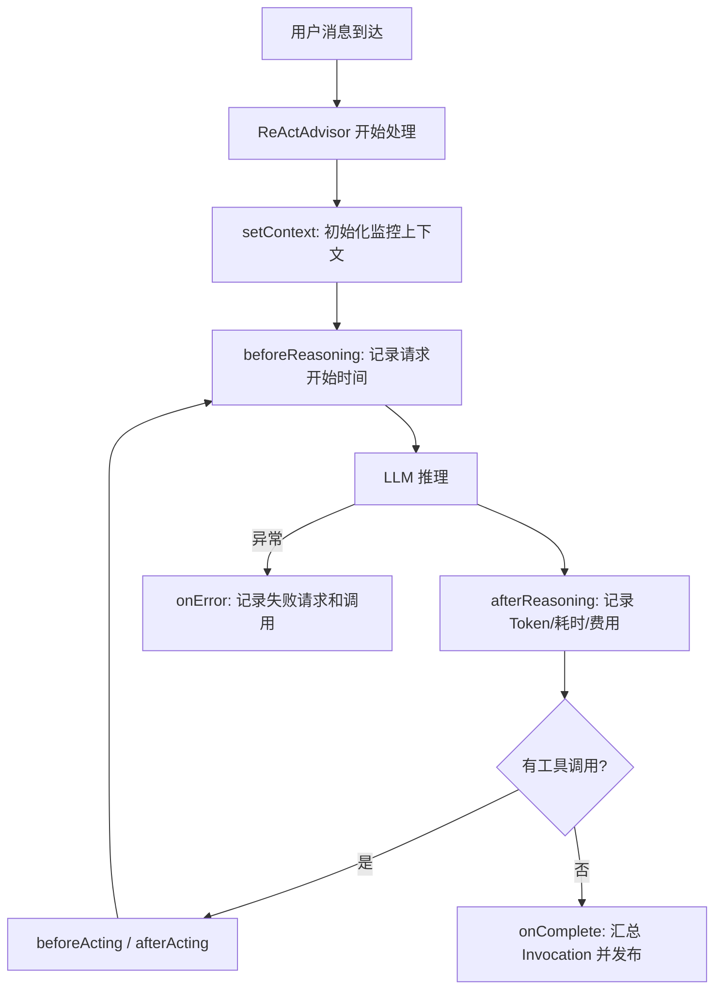

# 大模型应用开发：基于 ReActMiddleware 实现大模型交互监控

> 你的 Agent 每次调用大模型，消耗了多少 Token？花了多少钱？哪次调用失败了？ReAct 内部到底跑了几轮推理？
>
> 如果你回答不上来，说明你缺一套**大模型交互监控体系**。本文将手把手教你，基于 **ReActMiddleware 中间件机制**，零侵入地记录每一次模型调用的 Token、耗时、费用和链路信息。

---

## 一、为什么需要大模型交互监控？

当你把大模型接入业务系统后，一个很现实的问题就来了：

**你的 Token 花在哪了？**

这不仅仅是成本问题。在实际开发中，你会遇到这些场景：

| 场景 | 痛点 |
|------|------|
| 费用失控 | 月底一看账单，Token 费用远超预期，但不知道是哪个 Agent 消耗的 |
| 调用黑盒 | 一次用户请求，Agent 内部可能跑了 3 轮 ReAct 推理，你只能看到最终结果 |
| 故障定位 | 用户反馈"回复异常"，你不知道是模型超时、Token 超限还是工具调用失败 |
| 性能优化 | 想知道哪个 Agent 最慢、哪个模型最贵、哪类任务失败最多，但没有数据支撑 |
| 量化汇报 | 想在简历或汇报中写"累计处理 XX 万次模型调用"，但拿不出数据 |

> 对求职派来说，监控还有另一个意义：**作为 AI 大模型应用开发者，如果你的项目本身就有一套完整的大模型调用监控体系，这本身就是一个很好的面试素材。**

---

## 二、方案设计：从"包裹式"到"中间件式"

### 2.1 旧方案的问题

最初，求职派用的是"包裹式"监控——在 `LlmCaller` 层，用 `monitor.call()` 包裹每一次 `ChatClient.call()`：

```java
// 旧方案：LlmMonitor 接口（已废弃）
public interface LlmMonitor {
    <T> T call(LlmCallContext context, Prompt prompt, Supplier<T> supplier);
    <T> Flux<T> stream(LlmCallContext context, Prompt prompt, ...);
}
```

这个方案能用，但有两个明显的问题：

- **LlmCaller 必须感知 Monitor**：每个 Caller 都需要主动调用 `monitor.call()`，违背了关注点分离
- **ReAct 内部请求覆盖不到**：ReAct 循环中的多次推理直接调用 `chatModel.call()`，绕过了 LlmCaller 的包裹

### 2.2 新方案：ReActMiddleware 中间件

新方案的核心思路是：

> **把监控逻辑做成 ReActAdvisor 的中间件，利用 ReAct 循环预留的生命周期钩子，自动拦截每一次模型调用。**

就这么自然。不需要修改任何 Caller 代码，不需要在每个调用点埋点，只要注册一个 Middleware，所有经过 ReActAdvisor 的模型调用都会被自动记录。



### 2.3 为什么选择中间件方案？

| 对比维度 | 旧方案（包裹式） | 新方案（中间件式） |
|---------|--------------|---------------|
| 侵入性 | LlmCaller 需要感知 Monitor | 零侵入，注册即用 |
| ReAct 覆盖 | 只能记录外层调用 | 每次内部推理都能记录 |
| 扩展性 | 加功能要改 Caller | 加一个 Middleware 即可 |
| 状态管理 | ThreadLocal，有泄漏风险 | LocalCacheManager，自动过期 |
| 代码位置 | `core/monitor/del/`（已废弃） | `core/monitor/` |

---

## 三、ReActMiddleware：理解中间件机制

在写监控代码之前，先理解 `ReActMiddleware` 的生命周期。这是求职派 ReActAdvisor 预留的中间件接口，定义了 ReAct 循环中每个阶段的钩子：

### 3.1 生命周期钩子

```java
public interface ReActMiddleware {
    // ReAct 循环开始前：设置请求上下文
    default void setContext(ChatClientRequest request, String chatId) {}

    // Reasoning 阶段前：LLM 即将推理
    default void beforeReasoning(List<Message> messages, int iter, String chatId) {}

    // Reasoning 阶段后：LLM 推理完成（带完整 ChatResponse，含 Token 用量）
    default void afterReasoning(ChatResponse response, int iter, String chatId) {}

    // Acting 阶段前：即将执行工具
    default void beforeActing(List<AssistantMessage.ToolCall> toolCalls, int iter, String chatId) {}

    // Acting 阶段后：工具执行完毕
    default void afterActing(ToolResponseMessage toolResponses, int iter, String chatId) {}

    // 循环结束：ReAct 推理循环完成
    default void onComplete(int totalIters, String finalResponse, String chatId) {}

    // 异常时：循环中发生错误
    default void onError(Exception error, int iter, String chatId) {}
}
```

### 3.2 关键设计：`chatId` 跨钩子传递

每个钩子都带一个 `chatId` 参数。这个 ID 由 `ReActAdvisor` 在循环开始时生成，贯穿整个 ReAct 生命周期：

- **同步调用**：`chatId = "S-" + UUID`
- **异步/流式调用**：`chatId = "A-" + UUID`

通过 `chatId`，我们可以在 `setContext` 时创建监控状态，在 `afterReasoning` 时累加 Token，在 `onComplete` 时汇总发布——**所有钩子共享同一份状态**。

### 3.3 自动注入机制

Middleware 不需要手动注册。`ReActAdvisor.Builder` 提供了 `autoInjectMiddleware()` 方法，自动从 Spring 容器中扫描所有 `ReActMiddleware` 的 Bean：

```java
public Builder autoInjectMiddleware() {
    var middlewareBeans = SpringUtil.getContext().getBeansOfType(ReActMiddleware.class);
    middlewareBeans.values().forEach(this::addMiddleware);
    return this;
}
```

这意味着：**你只需要写一个 `@Component` 类实现 `ReActMiddleware`，它就会自动生效。**

---

## 四、核心实现：LlmMonitorMiddleware

这是整个监控方案的核心类。我们逐段拆解。

### 4.1 监控状态：用 LocalCacheManager 替代 ThreadLocal

旧方案用 `ThreadLocal` 存储调用状态，存在泄漏风险（尤其在流式和异步场景下）。新方案改用 `LocalCacheManager`，以 `chatId` 为 key 缓存监控状态，自动过期：

```java
@Slf4j
@Component
public class LlmMonitorMiddleware implements ReActMiddleware {

    private static final String CACHE_NAME = "llmMonitorState";

    private final ApplicationEventPublisher publisher;
    private final MeterRegistry meterRegistry;
    private final LocalCacheManager cacheManager;
    private final ModelProviders modelProviders;

    public LlmMonitorMiddleware(..., LocalCacheManager cacheManager, ...) {
        // 初始化缓存：30 分钟过期，最多 5000 条
        cacheManager.getCache(CACHE_NAME, Duration.ofMinutes(30), 5000);
    }
}
```

**MonitorState** 是一个内部类，记录了单次 Invocation 的所有累计指标：

```java
private static class MonitorState {
    final LlmCallContext context;       // 调用上下文
    final Instant started;              // 调用开始时间
    final AtomicInteger requests;       // 真实请求次数
    final AtomicLong duration;          // 累计耗时
    final AtomicLong inputTokens;       // 累计输入 Token
    final AtomicLong outputTokens;      // 累计输出 Token
    final AtomicLong totalTokens;       // 累计总 Token
    final AtomicBoolean usageKnown;     // 是否拿到过 Usage
    BigDecimal cost;                    // 累计费用
    final AtomicInteger published;      // CAS 防重复发布
    volatile long requestStartNanos;    // 单次请求开始时间
    String userInput;                   // 用户的原始提问
    ModelConfig.ModelInfo modelInfo;    // 当前模型信息
}
```

### 4.2 `setContext`：初始化监控上下文

ReAct 循环开始前，从请求中提取用户信息，构建调用上下文：

```java
@Override
public void setContext(ChatClientRequest request, String chatId) {
    UserConversationInfo user = extractUser(request);
    String operation = user != null && user.agent() != null ? "agent_chat" : "core_call";
    LlmCallContext context = user != null
            ? LlmCallContext.of(chatId, user, operation, chatId.startsWith("A-") ? "ASYNC" : "SYNC")
            : new LlmCallContext(chatId, "unknown", "unknown",
                    "unknown", "unknown", operation, chatId.startsWith("A-") ? "ASYNC" : "SYNC");
    MonitorState state = new MonitorState(context);
    state.modelInfo = user != null ? modelProviders.currentModelInfo(user.jobClawUserId()) : null;
    cacheManager.put(CACHE_NAME, chatId, state);
}
```

**关键细节：**

- 用户信息从 `ToolCallingChatOptions.getToolContext()` 中提取，这是 ReActAdvisor 传递上下文的标准方式
- `mode` 通过 `chatId` 前缀判断：`S-` 开头为同步，`A-` 开头为异步/流式
- 模型信息在 `setContext` 时就缓存下来，避免后续每次请求都去查询

### 4.3 `beforeReasoning`：记录请求开始

每次 LLM 推理前，记录开始时间和用户提问：

```java
@Override
public void beforeReasoning(List<Message> messages, int iter, String chatId) {
    MonitorState state = cacheManager.get(CACHE_NAME, chatId);
    if (state == null) return;
    state.requestStartNanos = System.nanoTime();
    // 提取最后一个 UserMessage 作为用户提问
    for (int i = messages.size() - 1; i >= 0; i--) {
        Message message = messages.get(i);
        if (message instanceof UserMessage) {
            state.userInput = message.getText();
            break;
        }
    }
}
```

**为什么只记 UserMessage？** 因为 ReAct 循环中，`messages` 列表会越来越长（包含历史推理和工具结果），我们只需要用户的原始提问作为采样内容。

### 4.4 `afterReasoning`：记录 Token、耗时、费用

这是最核心的钩子。每次 LLM 推理完成后，从 `ChatResponse` 中提取 Token 用量，计算耗时和费用：

```java
@Override
public void afterReasoning(ChatResponse response, int iter, String chatId) {
    MonitorState state = cacheManager.get(CACHE_NAME, chatId);
    if (state == null) return;

    // 1. 计算耗时
    long duration = (System.nanoTime() - state.requestStartNanos) / 1_000_000;
    state.requests.incrementAndGet();
    state.duration.addAndGet(duration);

    // 2. 提取 Token 用量
    Long inputTokens = null, outputTokens = null, totalTokens = null;
    if (response != null && response.getMetadata() != null
            && response.getMetadata().getUsage() != null) {
        var usage = response.getMetadata().getUsage();
        inputTokens = usage.getPromptTokens() == null ? null : usage.getPromptTokens().longValue();
        outputTokens = usage.getCompletionTokens() == null ? null : usage.getCompletionTokens().longValue();
        totalTokens = usage.getTotalTokens() == null ? null : usage.getTotalTokens().longValue();
        state.usageKnown.set(true);
        state.inputTokens.addAndGet(inputTokens == null ? 0 : inputTokens);
        state.outputTokens.addAndGet(outputTokens == null ? 0 : outputTokens);
        state.totalTokens.addAndGet(totalTokens == null ? 0 : totalTokens);
    }

    // 3. 计算费用
    BigDecimal cost = calculateCost(state.modelInfo, inputTokens, outputTokens);
    state.addCost(cost);

    // 4. 构建 Request 记录并发布事件
    LlmRequestRecord record = new LlmRequestRecord(...);
    safePublish(record);

    // 5. 记录 Micrometer 指标
    meterRegistry.counter("jobclaw.llm.requests", ...).increment();
    Timer.builder("jobclaw.llm.request.duration", ...).register(meterRegistry).record(duration);
    if (totalTokens != null) meterRegistry.counter("jobclaw.llm.tokens", ...).increment(totalTokens);
    if (cost != null) meterRegistry.counter("jobclaw.llm.estimated.cost", ...).increment(cost.doubleValue());
}
```

**几个关键设计：**

- **`afterReasoning(ChatResponse, ...)` 而非 `afterReasoning(AssistantMessage, ...)`**：后者不携带 Token 用量元数据，前者才有 `getMetadata().getUsage()`
- **Token 可能为 null**：某些模型不返回 Usage，此时 `usageKnown` 保持 `false`，最终 Invocation 的 Token 字段也会为 null
- **费用计算**：基于模型配置中的 `inputPricePerMillionTokens` 和 `outputPricePerMillionTokens`，没有配置价格时费用为 null

### 4.5 `onComplete`：汇总 Invocation

ReAct 循环完成时，清理缓存并发布 Invocation 汇总记录：

```java
@Override
public void onComplete(int totalIters, String finalResponse, String chatId) {
    MonitorState state = cacheManager.get(CACHE_NAME, chatId);
    if (state == null) return;
    cacheManager.remove(CACHE_NAME, chatId);
    publishInvocation(state, "SUCCESS", null);
    modelProviders.clearCurrentModelInfo(state.context.jobClawUserId());
}
```

### 4.6 `onError`：记录失败

循环中发生异常时，先发布失败的 Request 记录，再发布失败的 Invocation：

```java
@Override
public void onError(Exception error, int iter, String chatId) {
    MonitorState state = cacheManager.get(CACHE_NAME, chatId);
    if (state == null) return;
    cacheManager.remove(CACHE_NAME, chatId);
    if (state.requestStartNanos != 0) {
        publishFailedRequest(state, error);
    }
    publishInvocation(state, "FAILED", error);
    modelProviders.clearCurrentModelInfo(state.context.jobClawUserId());
}
```

**注意 `published` 的 CAS 保护**：`publishInvocation` 内部用 `compareAndSet(0, 1)` 确保只发布一次，避免 `onError` 和 `onComplete` 重复触发。

---

## 五、两层监控模型

监控数据分为两层，这和 OpenTelemetry 的设计思路一致：

### 5.1 Invocation（逻辑调用）

一次业务语义上的调用。对应一次用户请求的完整 ReAct 过程。

```java
public record LlmInvocationRecord(
    String invocationId,     // 调用 ID（= chatId）
    String jobClawUserId,    // 用户 ID
    String conversationId,   // 会话 ID
    String channel,          // 渠道（wechat/dingding/feishu）
    String agent,            // Agent 名称
    String operation,        // 操作类型（agent_chat/core_call）
    String mode,             // SYNC / ASYNC
    String outcome,          // SUCCESS / FAILED
    long durationMs,         // 总耗时
    int requestCount,        // 内部真实请求次数
    Long inputTokens,        // 累计输入 Token
    Long outputTokens,       // 累计输出 Token
    Long totalTokens,        // 累计总 Token
    BigDecimal estimatedCost,// 预估费用
    String errorMessage,     // 错误信息
    Instant createTime       // 创建时间
) {}
```

### 5.2 Request（真实请求）

一次真实的大模型 HTTP 请求。ReAct 内部每推理一次，就是一条 Request。

```java
public record LlmRequestRecord(
    String requestId,        // 请求 ID（UUID）
    String invocationId,     // 所属 Invocation ID
    String jobClawUserId,    // 用户 ID
    String conversationId,   // 会话 ID
    String channel,          // 渠道
    String agent,            // Agent 名称
    String operation,        // 操作类型
    String mode,             // SYNC / ASYNC
    String provider,         // 模型供应商（zhipu/ali/openai）
    String model,            // 模型名称（GLM-4-Flash/qwen-plus）
    String modelType,        // 模型类型（CHAT/VISION）
    String outcome,          // SUCCESS / FAILED
    long durationMs,         // 耗时
    Long inputTokens,        // 输入 Token
    Long outputTokens,       // 输出 Token
    Long totalTokens,        // 总 Token
    BigDecimal estimatedCost,// 预估费用
    String errorMessage,     // 错误信息
    String promptSample,     // Prompt 采样（脱敏）
    String responseSample,   // Response 采样（脱敏）
    Instant createTime       // 创建时间
) {}
```

### 5.3 示例：一次调用产生多条 Request

```
用户发送消息："帮我找一下北京的 Java 岗位"
│
├─ Invocation (1 条)
│   ├─ agent: job-fetch
│   ├─ operation: agent_chat
│   ├─ requestCount: 3
│   ├─ totalTokens: 4500
│   └─ estimatedCost: 0.027
│
├─ Request #0 (第 1 轮推理)
│   ├─ inputTokens: 800
│   ├─ outputTokens: 150（决定调用 searchJobs 工具）
│   └─ durationMs: 1200
│
├─ Request #1 (第 2 轮推理)
│   ├─ inputTokens: 1200
│   ├─ outputTokens: 200（决定调用 parseJobDetail 工具）
│   └─ durationMs: 1500
│
└─ Request #2 (第 3 轮推理)
    ├─ inputTokens: 1800
    ├─ outputTokens: 350（生成最终回答）
    └─ durationMs: 2000
```

---

## 六、事件驱动持久化

监控数据的持久化采用了**事件驱动**的方式，`core` 模块只负责发布事件，`backend` 模块负责监听并落库。

### 6.1 为什么用事件驱动？

这是一个很重要的架构边界：

- `core` 模块不依赖 Web 层
- `core` 模块不直接依赖 JPA Repository
- 持久化失败不影响主调用链路
- `backend` 模块可以自由决定怎么存、存到哪

### 6.2 事件监听与落库

`backend` 模块中定义了 `LlmMonitorPersistenceListener`，通过 `@EventListener` + `@Async` 异步监听：

```java
@Slf4j
@Component
public class LlmMonitorPersistenceListener {
    private final LlmInvocationRepository invocations;
    private final LlmRequestRepository requests;

    @Async
    @EventListener
    public void save(LlmInvocationRecord r) {
        try {
            LlmInvocationEntity e = new LlmInvocationEntity();
            e.setId(r.invocationId());
            // ... 字段映射 ...
            invocations.save(e);
        } catch (Exception e) {
            log.warn("Failed to persist LLM invocation {}", r.invocationId(), e);
        }
    }

    @Async
    @EventListener
    public void save(LlmRequestRecord r) {
        try {
            LlmRequestEntity e = new LlmRequestEntity();
            e.setId(r.requestId());
            // ... 字段映射 ...
            requests.save(e);
        } catch (Exception e) {
            log.warn("Failed to persist LLM request {}", r.requestId(), e);
        }
    }
}
```

**关键设计：**

- `@Async` 确保异步执行，不阻塞主调用
- `try-catch` 包裹，持久化失败只打 warn 日志，不影响业务
- `safePublish` 中也有兜底，事件发布失败会记录 `jobclaw.llm.telemetry.dropped` 指标

### 6.3 数据库表结构

两张表对应两层模型：

**`llm_invocation`（逻辑调用表）：**

| 字段 | 类型 | 说明 |
|------|------|------|
| `id` | String | 调用 ID（= chatId） |
| `job_claw_user_id` | String | 用户 ID |
| `conversation_id` | String | 会话 ID |
| `channel` | String | 渠道 |
| `agent` | String | Agent 名称 |
| `operation` | String | 操作类型 |
| `mode` | String | SYNC / ASYNC |
| `outcome` | String | SUCCESS / FAILED |
| `duration_ms` | Long | 总耗时 |
| `request_count` | Integer | 内部请求次数 |
| `input_tokens` | Long | 累计输入 Token |
| `output_tokens` | Long | 累计输出 Token |
| `total_tokens` | Long | 累计总 Token |
| `estimated_cost` | BigDecimal | 预估费用 |
| `error_message` | String(2000) | 错误信息 |
| `create_time` | Instant | 创建时间 |

**`llm_request`（真实请求表）：**

| 字段 | 类型 | 说明 |
|------|------|------|
| `id` | String | 请求 ID |
| `invocation_id` | String | 所属 Invocation |
| `provider` | String | 模型供应商 |
| `model` | String | 模型名称 |
| `model_type` | String | 模型类型 |
| `duration_ms` | Long | 耗时 |
| `input_tokens` | Long | 输入 Token |
| `output_tokens` | Long | 输出 Token |
| `total_tokens` | Long | 总 Token |
| `estimated_cost` | BigDecimal | 预估费用 |
| `prompt_sample` | CLOB | Prompt 采样 |
| `response_sample` | CLOB | Response 采样 |

---

## 七、费用计算

费用基于模型配置中的单价估算，不是精确账单：

```java
private BigDecimal calculateCost(ModelConfig.ModelInfo info, Long input, Long output) {
    if (info == null || (input == null && output == null)) return null;
    BigDecimal cost = BigDecimal.ZERO;
    boolean known = false;
    if (input != null && info.getInputPricePerMillionTokens() != null) {
        cost = cost.add(info.getInputPricePerMillionTokens().multiply(BigDecimal.valueOf(input)));
        known = true;
    }
    if (output != null && info.getOutputPricePerMillionTokens() != null) {
        cost = cost.add(info.getOutputPricePerMillionTokens().multiply(BigDecimal.valueOf(output)));
        known = true;
    }
    return known ? cost.divide(BigDecimal.valueOf(1_000_000), 8, RoundingMode.HALF_UP) : null;
}
```

**费用计算规则：**

| 条件 | 结果 |
|------|------|
| 有 Usage 且有价格配置 | 计算费用 |
| 无 Usage（模型未返回） | 费用为 null |
| 未配置价格 | 费用为 null |
| 只有 input 或 output 之一 | 只算有价格的那部分 |

> 费用字段是"预估值"，不是账单金额。它的作用是做趋势对比，而非精确计费。

---

## 八、采样与脱敏

### 8.1 采样策略

不是每条请求都需要保存完整的 Prompt 和 Response。采样规则：

```java
private String sample(String text, String outcome) {
    if (text == null) return null;
    String cleaned = text.replaceAll("(?i)Bearer\\s+\\S+", "Bearer ***")
            .replaceAll("[\\w.+-]+@[\\w.-]+", "***@***")
            .replaceAll("1[3-9]\\d{9}", "***")
            .replaceAll("\\b\\d{17}[\\dXx]\\b", "***");
    final int size = ("FAILED".equals(outcome) || Math.random() <= 0.01) ? 4000 : 100;
    return cleaned.substring(0, Math.min(cleaned.length(), size));
}
```

| 请求类型 | 采样长度 | 概率   | 说明 |
|---------|---------|------|------|
| 失败请求 | 最多 4000 字符 | 100% | 全量保存，用于问题排查 |
| 成功请求 | 最多 4000 字符 | 1%   | 保留较完整的上下文 |
| 成功请求 | 最多 100 字符 | 99%  | 短采样，节省存储空间 |

换句话说：**失败请求永远保留完整内容，成功请求只有 1% 会被保存 4000 字符，其余 99% 保留最多 100 字符，用于节省空间。**

### 8.2 脱敏范围

| 敏感类型 | 正则 | 替换为 |
|---------|------|--------|
| Bearer Token | `Bearer\s+\S+` | `Bearer ***` |
| 邮箱 | `[\w.+-]+@[\w.-]+` | `***@***` |
| 手机号 | `1[3-9]\d{9}` | `***` |
| 身份证号 | `\b\d{17}[\dXx]\b` | `***` |

---

## 九、指标体系

除了数据库持久化，监控数据还通过 Micrometer 暴露为 Metrics 指标，可以直接对接 Prometheus + Grafana：

| 指标名 | 类型 | 说明 |
|--------|------|------|
| `jobclaw.llm.invocations` | Counter | 逻辑调用次数 |
| `jobclaw.llm.requests` | Counter | 真实请求次数 |
| `jobclaw.llm.request.duration` | Timer | 请求耗时分布 |
| `jobclaw.llm.tokens` | Counter | Token 总量 |
| `jobclaw.llm.estimated.cost` | Counter | 预估费用总量 |
| `jobclaw.llm.telemetry.dropped` | Counter | 事件发布失败次数 |

### 9.1 标签约束

指标标签只允许低基数维度：

- `agent`、`operation`、`provider`、`model`、`mode`、`outcome`

**不允许**放入高基数维度：

- 用户 ID、会话 ID、消息 ID、Request ID

这些字段适合放进数据库，不适合放进 Metrics——否则会导致 Prometheus 的时间序列爆炸。

---

## 十、接口设计

### 10.1 管理员接口

管理员可以看全局数据，支持按用户、Agent、操作、结果过滤：

```
GET /api/admin/llm-monitor/overview           # 全局用量概览
GET /api/admin/llm-monitor/calls              # 调用列表（支持分页 + 过滤）
GET /api/admin/llm-monitor/calls/{id}         # 调用详情（含 Request 链路）
```

管理员接口不需要传 `userId`，可以查看所有人的数据，并且在列表中附带用户昵称。

### 10.2 用户接口

用户只能看自己的数据，`userId` 从 `ReqInfoContext` 中获取，不接受客户端传入：

```
GET /api/user/llm-usage/overview              # 我的用量概览
GET /api/user/llm-usage/calls                 # 我的调用列表
GET /api/user/llm-usage/calls/{id}            # 我的调用详情
```

**权限边界：**

```java
// 用户接口：从 ReqInfoContext 取当前登录用户，强制过滤
private String uid() {
    return String.valueOf(ReqInfoContext.getReqInfo().getUserId());
}

@GetMapping("/calls")
public PageListVo<LlmCallVo> calls(String agent, String operation, String outcome, ...) {
    return service.calls(uid(), agent, operation, outcome, page, size);
}
```

| 角色 | 可见范围 | 采样内容 |
|------|---------|---------|
| 管理员 | 全局数据 | 可见 Prompt/Response 采样 |
| 普通用户 | 仅自己的数据 | 可见元数据，不含敏感内容 |
| 未绑定用户的调用 | 仅管理员可见 | — |

---

## 十一、Micrometer + Actuator 集成

除了自定义的数据库查询，指标还通过 Spring Boot Actuator 暴露，可以直接对接监控系统：

```yaml
# application.yml
management:
  endpoints:
    web:
      exposure:
        include: health,info,prometheus
```

在 Grafana 中，你可以用这些 PromQL 查询：

```promql
# 过去 5 分钟各 Agent 的请求速率
rate(jobclaw_llm_requests_total[5m])

# 各模型的平均耗时
rate(jobclaw_llm_request_duration_seconds_sum[5m]) / rate(jobclaw_llm_request_duration_seconds_count[5m])

# 过去 1 小时的 Token 消耗
increase(jobclaw_llm_tokens_total[1h])

# 过去 1 小时的预估费用
increase(jobclaw_llm_estimated_cost_total[1h])
```

---

## 十二、已有的中间件生态

`ReActMiddleware` 不仅仅用于监控。求职派当前已经注册了多个中间件实现：

| 中间件 | 位置 | 功能 |
|--------|------|------|
| `LlmMonitorMiddleware` | `core/monitor/` | Token/耗时/费用监控 |
| `LoggingReActMiddleware` | `core/agent/react/` | ReAct 推理过程日志 |
| `PlanHintReActMiddleware` | `plugins/plan-notebook/` | 计划本提示注入 |

每个中间件各自独立，互不干扰。你可以按需启用或禁用——只需要控制 Spring Bean 的注册即可。

---

## 十三、踩坑记录

### 坑 1：`afterReasoning` 有两个重载，用错了拿不到 Token

**现象：** Token 统计始终为 null，费用也没有

**原因：** `ReActMiddleware` 定义了两个 `afterReasoning` 方法：
- `afterReasoning(AssistantMessage, int, String)` — 只有推理结果文本，**没有 Token 用量**
- `afterReasoning(ChatResponse, int, String)` — 有完整的 `ChatResponse`，包含 `getMetadata().getUsage()`

**解决：** 监控中间件必须重写 `afterReasoning(ChatResponse, ...)` 这个版本。接口中这个版本的默认实现会委托给 `AssistantMessage` 版本，所以如果你重写错了，代码不会报错，但 Token 数据就丢了。

### 坑 2：ThreadLocal 在流式场景下泄漏

**现象：** 流式调用（`Flux`）完成后，监控状态没有被清理

**原因：** 旧方案用 `ThreadLocal` 存储状态，但流式调用是异步的，线程会切换，`ThreadLocal.remove()` 可能不会在正确的时机执行

**解决：** 新方案改用 `LocalCacheManager`（基于 Guava Cache），以 `chatId` 为 key 缓存状态，30 分钟自动过期。即使 `onComplete` / `onError` 没有被正确触发，缓存也会自动回收。

### 坑 3：ReAct 循环中首次推理的 Middleware 通知

**现象：** 第一轮推理的 `beforeReasoning` 被调用了两次

**原因：** `ReActAdvisor.adviseCall()` 的流程是：先调 `notifySetContext` + `notifyBeforeReasoning`，然后走 Advisor Chain 执行第一次推理。如果第一次推理就有工具调用，进入 ReAct 循环后会再次通知 `beforeReasoning`

**解决：** 这是设计如此。第一次 `beforeReasoning` 是"预热"，让中间件准备好状态；进入循环后的 `beforeReasoning` 才是正式记录开始时间。`LlmMonitorMiddleware` 通过覆盖 `requestStartNanos` 来处理这种情况。

### 坑 4：事件发布失败导致主流程异常

**现象：** 监控事件发布时 Spring 报错，导致 Agent 的响应也失败了

**原因：** `ApplicationEventPublisher.publishEvent()` 默认是同步的，如果 Listener 抛异常，会传播给调用方

**解决：** `safePublish` 方法用 try-catch 包裹，发布失败只记录 `jobclaw.llm.telemetry.dropped` 指标和 warn 日志，不影响主流程：

```java
private void safePublish(Object event) {
    try {
        publisher.publishEvent(event);
    } catch (Exception e) {
        meterRegistry.counter("jobclaw.llm.telemetry.dropped").increment();
        log.warn("Failed to publish LLM monitor event", e);
    }
}
```

---

## 十四、总结

回顾一下这套基于 ReActMiddleware 的大模型交互监控方案：

| 特性 | 说明 |
|------|------|
| 实现方式 | ReActMiddleware 中间件，零侵入 |
| 监控层级 | Invocation（逻辑调用） + Request（真实请求） |
| Token 统计 | 从 `ChatResponse.getMetadata().getUsage()` 提取 |
| 费用估算 | 基于模型配置的单价 × Token 数量 |
| 状态管理 | LocalCacheManager（Guava Cache），30 分钟自动过期 |
| 持久化 | Spring Event + @Async Listener，异步落库 |
| 指标暴露 | Micrometer，支持 Prometheus + Grafana |
| 采样脱敏 | 失败全量保存，成功采样保存，自动脱敏 |
| 权限控制 | 管理员看全局，用户看自己 |

这套方案的核心思想可以用一句话概括：

> **把监控做成 ReActAdvisor 的"旁观者"，而不是业务代码的"入侵者"。**

通过中间件机制，监控逻辑和业务逻辑完全解耦。Agent 不需要知道自己被监控了，Caller 不需要写任何埋点代码，你只需要注册一个 `@Component`，所有的 Token、耗时、费用就会被自动记录。

如果你的项目也在用 Spring AI + ReAct 模式做大模型调用，强烈建议试试这个思路。从注册到看到第一条监控数据，大概 **5 分钟**。

---

> 本文是**求职派**大模型应用开发实战系列的第 17 篇。如果你对 AI + 工程化实践感兴趣，欢迎关注后续更新。
