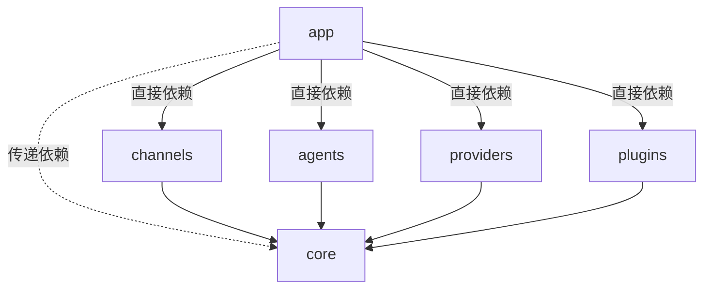

# 求职派 V2 重构：从单体应用到多 Agent 运行时的全面演进

> V2 不是简单的版本升级，而是一次从"校招信息展示应用"到"OpenClaw 式多 Agent 运行时"的架构跃迁。本文完整记录这次重构的背景、目标、架构设计与落地进展。

---

## 一、为什么要做 V2 重构？

### 1.1 V1 的局限

V1 版本的求职派是一个典型的 Spring Boot 单体应用：

- **单一渠道**：只支持微信公众号登录，用户只能通过网页与系统交互
- **单一模型**：硬编码方式实现大模型交互，切换新的模型需要自主集成扩展实现
- **无 Agent 概念**：大模型调用散落在业务代码中，没有统一的 Agent 抽象
- **无会话管理**：没有对话上下文，没有记忆系统，每次对话都是"无状态"的
- **无任务调度**：不支持定时推送、周期性采集等异步场景
- **用户体系薄弱**：没有用户画像，没有偏好管理，无法做到"千人千面"

简单说，V1 能跑，但**扩展不动了**。想加一个钉钉渠道？要改一堆代码。想接一个新模型？又是大面积改动。想让 AI 记住用户偏好？根本没有这个基础设施。

### 1.2 V2 的核心诉求

我们希望 V2 版本能够回答一个问题：

> **如何让求职派从一个"功能型应用"演进为一个"智能体运行时"，支持多渠道、多模型、多 Agent 的灵活组合？**

---

## 二、V2 设计目标

V2 的重构目标可以概括为 **五个"多"** 和 **一个"隔离"**：

| 目标 | 说明 |
|------|------|
| **多渠道** | 微信、钉钉、飞书等多种 IM 渠道即插即用 |
| **多模型** | OpenAI、智谱、Anthropic 等多家模型按需切换 |
| **多 Agent** | 身份采集、岗位抓取、岗位推荐、任务管理等业务 Agent 独立开发、独立部署 |
| **多工具** | MCP 客户端、Playwright 浏览器、岗位检索等工具能力可插拔 |
| **多任务** | 一次性任务、周期性任务、延时任务的完整调度能力 |
| **用户隔离** | 按用户 ID 隔离会话、任务、偏好，互不干扰 |

---

## 三、架构演进：V1 → V2

### 3.1 V1 架构

V1 是传统的三层架构，所有逻辑耦合在一个 `app` 模块中：

```
V1：单体应用
┌─────────────────────────┐
│     微信公众号入口        │
├─────────────────────────┤
│   Controller → Service   │
│   (大模型调用散落其中)    │
├─────────────────────────┤
│     JPA + MySQL/H2       │
└─────────────────────────┘
```

### 3.2 V2 架构

V2 采用**模块化多 Agent 运行时**架构，按职责拆分为 6 大 Maven 模块组（app / core / channels / agents / providers / plugins）+ 前端：

```
V2：多 Agent 运行时
┌──────────────────────────────────────────────────────────┐
│                IM 渠道层 (channels/)                       │
│     微信 ClawBot │ 钉钉 (WebSocket) │ 飞书                │
├──────────────────────────────────────────────────────────┤
│        消息网关 & 事件总线 (core/channel/ + core/bus/)      │
│     AbsChannel │ ChannelBinder │ ChannelEventPublisher   │
├──────────────────────────────────────────────────────────┤
│           对话管理层 (core/router/ + core/cli/)            │
│     MsgRouter │ IntentClassifier │ AgentRouter           │
│     SystemCommandDispatcher（/help, /agents, /reset...）  │
├──────────────────────────────────────────────────────────┤
│             业务 Agent 层 (agents/)                        │
│   身份采集 │ 岗位抓取 │ 岗位推荐 │ 任务提醒 │ 偏好设置     │
├──────────────────────────────────────────────────────────┤
│            工具 & 模型层                                    │
│   core/tools/ (TaskTool, McpTool, CheckListTool)         │
│   plugins/ (Playwright, JobLibrary)                      │
│   providers/ (OpenAI, 智谱, 阿里, Anthropic)             │
├──────────────────────────────────────────────────────────┤
│             基础设施 (core/)                               │
│   agent/llm/    LlmCaller 三级调用                        │
│   agent/memory/ 记忆管理（YAML 持久化 + 滑动窗口 + 摘要） │
│   agent/react/  ReAct Advisor（工具调用增强）              │
│   preference/   用户级 AI 偏好配置                        │
│   tasks/        任务调度（JobRunr）                        │
│   configuration/ 动态配置组件                              │
│   apis/         通用 API 模型（ResVo, 权限, 上下文）       │
├──────────────────────────────────────────────────────────┤
│         应用层 (app/) + 前端 (ui-react/)                   │
│   agents/ LangGraph4J 工作流 │ gather/ AI 采集流水线      │
│   oc/ 职位数据 │ user/ 用户会员 │ web/ Controller         │
│   openapi/ 跨平台集成 │ configs/ 全局字典                  │
└──────────────────────────────────────────────────────────┘
```

### 3.3 架构对比

| 维度 | V1            | V2 |
|------|---------------|----|
| 代码组织 | 单体 app 模块 | 6 大模块组 + 前端，职责隔离 |
| 渠道接入 | 微信公众号登录       | 微信/钉钉/飞书，Channel 抽象层即插即用 |
| 大模型 | 硬编码单一模型 | Provider 抽象层，用户级模型偏好切换 |
| AI 调用 | 散落在 Service 中 | 统一 `LlmCaller` 接口，三级实现 |
| 对话管理 | 无             | 意图识别 + 会话绑定 + Agent 路由 |
| 记忆系统 | 无             | YAML 文件持久化 + 滑动窗口 + 摘要生成 |
| 任务调度 | 无             | 一次性/周期性/延时任务，按用户隔离 |
| 用户画像 | 无             | Soul/Identity/Info 三层画像体系 |
| 工具能力 | 无             | MCP + Playwright + 岗位检索，可插拔 |
| 权限管控 | 简单角色          | 渠道级 Scope（OWNER/LOGIN/VIP/PUBLIC） |

---

## 四、模块架构详解

### 4.1 模块划分

```
JobClaw/
├── app/                          # 主应用：Web/Admin/职位数据/用户/MCP Server
│   ├── agents/                   #   LangGraph4J 岗位数据工作流（TaskClassify/Gather/Wash/Publish）
│   ├── gather/                   #   AI 岗位采集流水线（GatherAiAgent, OfferGatherService）
│   ├── oc/                       #   职位信息 CRUD、草稿管理、MCP Server 端点
│   ├── user/                     #   用户管理、微信登录、会员、支付
│   ├── openapi/                  #   跨平台账号集成（技术派 PaiCoding）
│   ├── configs/                  #   全局字典、环境配置
│   ├── constants/                #   各业务领域枚举常量
│   ├── components/               #   异步调度、异常处理、全局上下文、雪花 ID
│   ├── util/                     #   工具类集合
│   └── web/                      #   Controller、鉴权拦截、全局返回封装
├── core/                         # 核心骨架：Agent 抽象、路由、事件总线、记忆、任务
│   ├── channel/                  #   Channel 抽象层（AbsChannel, ChannelBinder）
│   ├── agent/                    #   Agent 抽象层
│   │   ├── impl/                 #     AbsBizAgent 基类
│   │   ├── llm/                  #     LlmCaller 三级调用（Simple/BizAgent/UserPreference）
│   │   ├── memory/               #     记忆管理（FileSystemChatMemory, SmartWindow, 归档）
│   │   ├── models/               #     Agent 模型定义
│   │   └── react/                #     ReAct Advisor（工具调用增强、推理日志）
│   ├── bus/                      #   消息事件总线（ChannelEventPublisher）
│   ├── router/                   #   消息路由
│   │   └── intent/               #     意图识别 + AgentRouter + AgentRegistry
│   ├── cli/                      #   系统命令（/help, /agents, /current, /reset, /agent）
│   ├── providers/                #   ModelProvider 抽象 + ModelProviders 缓存
│   ├── preference/               #   用户级 AI 偏好配置（模型选择、API Key）
│   ├── tools/                    #   内置工具（TaskTool, McpTool, CheckListTool）
│   ├── tasks/                    #   任务管理（JobRunr 调度）
│   ├── configuration/            #   动态配置组件
│   ├── apis/                     #   通用 API 模型（ResVo, PageListVo, 权限、上下文）
│   ├── bizexception/             #   业务异常定义
│   └── utils/                    #   工具类（文件、MD5、MIME、脱敏、Spring）
├── channels/                     # IM 渠道实现
│   ├── wechat-clawbot/           #   微信 ClawBot
│   ├── dingding/                 #   钉钉（WebSocket + Flux.Sink 流式）
│   └── feishu/                   #   飞书（图片/文件/富文本）
├── agents/                       # 独立业务 Agent
│   ├── identity-collector-agent/ #   用户身份/画像采集（Soul/Identity/Info 三层）
│   ├── job-fetch-agent/          #   岗位信息抓取（文本/图片/URL/文件解析）
│   └── job-recommend-agent/      #   岗位推荐
├── providers/                    # 模型提供者
│   ├── openai/                   #   OpenAI 兼容接口
│   ├── zhipu/                    #   智谱
│   └── anthropic/                #   Anthropic Claude
├── plugins/                      # 工具插件
│   ├── playwright/               #   浏览器自动化（JS 渲染页面抓取）
│   └── job-library/              #   岗位库检索（基于 oc 数据）
└── ui-react/                     # 前端（Next.js 15 + React 19 + shadcn/ui + TailwindCSS）
```

### 4.2 模块依赖关系



核心原则：

- `core` 是共享基础，channels / agents / providers / plugins **直接依赖**它，但 core 不依赖任何业务模块
- `app` 是组装模块，**直接依赖** channels / agents / providers / plugins，通过它们**传递依赖** core，负责启动 Spring Boot 应用
- 扩展规则：新增渠道 → `channels/{new}`，新增 Agent → `agents/{new}`，新增模型 → `providers/{new}`，新增工具 → `plugins/{new}`

---

## 五、核心链路设计

### 5.1 消息处理主链路

这是 V2 架构中**最重要的一条链路**，理解它就理解了整个系统的工作方式：

```
IM 消息到达（微信/钉钉/飞书）
  │
  ▼
AbsChannel.processMessage()          ← 渠道层：消息适配
  → adaptToReceive()                  ← 统一为 ChannelReceiveMessage
  → reportToAgent()                   ← 发布事件
  │
  ▼
ChannelEventPublisher                ← 事件总线：解耦
  → publishMessageReceived()
  → MessageReceivedEvent
  │
  ▼
MsgRouter.onMessageReceived()        ← 对话管理层：核心路由
  Step 1: IIdentityAgent             ← 自动触发身份采集
  Step 2: SystemCommandDispatcher     ← 系统命令（/help, /reset...）
  Step 3: SessionAgentBinder          ← 已绑定 Agent 则跳过识别
  Step 4: IntentClassifier            ← 关键词 + LLM 混合意图识别
  Step 5: AgentRouter                 ← 意图 → Agent 映射
  Step 6: SessionAgentBinder.bind()   ← 持久化会话-Agent 绑定
  Step 7: BizAgent.process/stream()   ← 业务 Agent 处理
  │
  ▼
ChannelEventPublisher                ← 响应回写
  → publishMessageResponse()
  → Channel.responseToUser()
```

### 5.2 LLM 调用三级架构

V2 抽象了统一的 `LlmCaller` 接口，提供三个级别的实现：

| 级别 | 实现类 | 特点 | 适用场景 |
|------|--------|------|---------|
| 基础级 | `SimpleLlmCaller` | 不持久化对话，不注册工具 | 简单问答、一次性调用 |
| 业务级 | `BizAgentLlmCaller` | 注册 Agent 工具，持久化对话，加载 SOUL.md | 业务 Agent 场景 |
| 用户级 | `UserPreferenceBasedLlmCaller` | 加载用户画像，支持 ToolSearch | 职位推荐、个性化对话 |

### 5.3 模型解析策略

模型按用户偏好动态解析，格式为 `provider#ModelName`：

```
用户偏好：zhipufree#GLM-4-Flash
              │         │
              ▼         ▼
        Provider 名    模型名
              │
              ▼
    ModelProviders.getModel(userId, modelType)
              │
              ▼
    具体 Provider 返回 Model 实例
```

支持 7 种模型类型：TEXT、VISION、IMAGE、VIDEO、EMBEDDING、ASR、TTS。

---

## 六、记忆与会话系统

V2 引入了完整的记忆工程，这是区别于 V1 的核心能力之一。

### 6.1 记忆分层

| 层级 | 内容 | 存储方式 | 作用 |
|------|------|---------|------|
| 工作记忆 | 最近 N 轮完整对话 | YAML 文件 | 保证对话连贯性 |
| 短期摘要 | 较早对话的结构化摘要 | YAML 文件 | 压缩历史上下文 |
| 长期记忆 | 用户偏好、关键事实 | workspace/users/ | 个性化服务 |

### 6.2 用户画像三层体系

由 `identity-collector-agent` 实现：

| 层级 | 文件 | 内容 | 采集方式 |
|------|------|------|---------|
| Soul | `soul.md` | 人格、价值观、职业志向 | AI 提取 |
| Identity | `user.md` | 技能、学历、经验 | 规则 + AI |
| Info | `info.md` | 基础信息 | 元数据提取 |

### 6.3 会话管理

- 存储路径：`workspace/conversations/{jobClawUserId}/chat-{sessionId}.yaml`
- 按用户、按渠道、按对话机器人三维隔离
- 滑动窗口策略控制上下文长度
- 异步摘要生成，不阻塞用户交互

---

## 七、任务调度系统

V2 从零构建了任务管理能力：

| 任务类型 | 说明 | 存储位置 |
|---------|------|---------|
| 一次性任务 | 定时提醒、延时执行 | `workspace/tasks/{userId}/年-月-日/` |
| 周期性任务 | 按 Cron 表达式周期触发 | `workspace/tasks/{userId}/recurring/` |
| 计划任务 | 未来某个时间点执行 | 同上 |

所有任务与 `JobClawUserId` 关联，实现用户级隔离。

---

## 八、渠道权限管控

V2 引入了渠道级的 Scope 权限模型：

| Scope | 说明 | 适用场景 |
|-------|------|---------|
| `OWNER` | 只有创建者可以对话 | 个人专属机器人 |
| `LOGIN` | 绑定求职派用户可对话 | 团队内部使用 |
| `VIP` | VIP 用户可对话 | 付费用户专属 |
| `PUBLIC` | 所有用户可对话 | 公开服务 |

同时区分群聊与私聊：
- 群聊中不支持设置用户个人偏好
- 绑定用户后基于 `JobClawUserId` 构建偏好和会话
- 未绑定用户基于 `OpenId` 存储，功能受限

---

## 九、技术栈升级一览

### 9.1 后端

| 技术 | V1 | V2 |
|------|----|----|
| JDK | 17 | **21**（虚拟线程、模式匹配） |
| Spring Boot | 3.x | **4.x** |
| Spring AI | 1.x | **2.x** |
| 新增 | - | LangGraph4J、Spring Modulith、JobRunr |

### 9.2 前端

| 技术 | V1 | V2 |
|------|----|----|
| React | 18 | **19** |
| Next.js | 14 | **15** |
| UI 库 | 自定义 | **shadcn/ui**（Radix 原语） |
| 包管理 | npm | **pnpm** |

---

## 十、关键技术挑战

V2 重构过程中面临的 12 个核心技术挑战，以及对应的设计方向：

| # | 挑战 | 核心问题 | 设计方向 |
|---|------|---------|---------|
| 1 | 工具管理 | 工具太多，全注册还是按需注册？ | 分层注册 + 工具搜索层 + 错误降级 |
| 2 | 意图识别 | 如何自动路由到正确的 Agent？ | 关键词 + LLM 混合分类器 |
| 3 | 多轮对话状态 | 如何保证 Agent 不串台？ | 会话绑定 + 状态锁定 + 显式切换 |
| 4 | 模型可靠性 | 如何无缝切换 + 结果可信？ | 统一接口 + 健康检查 + 置信度 |
| 5 | 多 Agent 协作 | Agent 之间如何配合？ | Agent 注册中心 + 消息总线 + LangGraph 编排 |
| 6 | 上下文窗口 | 对话太长怎么办？ | 分层记忆 + 消息评分 + 多级压缩 |
| 7 | 用户隔离 | 不同用户数据如何隔离？ | 按 JobClawUserId 隔离文件 + 统一画像 |
| 8 | 记忆工程 | 如何让 AI 越用越懂你？ | 短期记忆 + 长期记忆 + 自动提取 |
| 9 | 复杂任务拆解 | 大任务如何分步执行？ | DAG 分解 + 容错 + 状态追踪 |
| 10 | Agent 自主工作 | 如何让 Agent 主动行动？ | 周期任务 + 事件驱动 + 主动推送 |
| 11 | 自学习进化 | 如何越用越智能？ | 画像构建 + 反馈循环 + 在线学习 |
| 12 | 安全监控 | 如何防范提示注入和越权？ | 输入隔离 + 输出编码 + 审计日志 |

---

## 十一、迭代里程碑

V2 的开发按照 5 个 Phase 推进：

### Phase 1：记忆工程（已完成 ✅）

**时间：2026-04-10 ~ 2026-04-16**

- 完成 V2 项目重构和模块拆分
- 建立上下文管理方案：滑动窗口 + AI 摘要
- 实现基于 YAML 文件的会话持久化
- 实现用户画像自动提取
- 完成新用户引导信息收集（异步流式）
- 建立用户身份说明文件体系（soul.md / info.md / user.md / agent.md / tools.md）
- 接入钉钉、飞书通道

### Phase 2：意图识别与路由（已完成 ✅）

**时间：2026-04-17 ~ 2026-04-18**

- 实现关键词 + LLM 混合意图分类器
- 实现 Agent 路由机制和会话状态锁定
- 支持 `/help`、`/agents`、`/agent`、`/reset`、`/current` 系统命令
- 新增个人偏好设置 Agent

### Phase 3：业务能力封装（进行中 🚧）

**时间：2026-04-20 ~ 至今**

- 封装 JobFetchAgent（岗位抓取）
- 封装 JobRecommendAgent（岗位推荐）
- 完成文本/Markdown/HTML/Excel/CSV 自动提取岗位信息
- 实现渠道 Scope 权限管控
- 完成 LLM 调用层重构（LlmCaller 三级架构）
- 新增 TaskBizAgent（任务编制与提醒）
- 完成 GitHub Actions AI 代码审核集成

### Phase 4：用户偏好与自学习（待启动 ⏳）

- 用户画像数据结构设计
- 偏好提取逻辑实现
- 行为分析和反馈循环
- 用户级 API Key 管理

### Phase 5：安全与监控（待启动 ⏳）

- 输入输出安全检查
- 审计日志系统
- 速率限制和防滥用
- 监控告警

---

## 十二、首次启动指南

### 12.1 环境配置

```bash
# 1. 复制环境变量
cp .env.example .env

# 2. 拷贝数据库（避免污染种子数据）
cp workspace/datas/jobclaw.mv.db workspace/datas/jobclaw-my.mv.db
# 在 .env 中设置：JOBCLAW_DATABASE_NAME=jobclaw-my

# 3. 配置大模型 API Key（默认使用智谱）
# 在 .env 中设置：ZHIPU_API_KEY=your_key_here

# 4. 启动后端
./mvnw spring-boot:run

# 5. 启动前端（可选）
cd ui-react && pnpm install && pnpm dev
```

### 12.2 访问系统

1. 浏览器打开 `http://localhost:8087`
2. 选择「游客登录」快速体验 或 「管理员登录」获取完整权限
3. 进入「个人中心」→「渠道配置」添加 IM 机器人
4. 在 IM 中发送消息，系统自动路由到合适的 Agent

### 12.3 系统命令

| 命令 | 说明 |
|------|------|
| `/help` | 查看所有可用命令 |
| `/agents` | 查看可用 Agent 列表 |
| `/current` | 查看当前会话绑定的 Agent |
| `/agent <id>` | 切换到指定 Agent |
| `/reset` | 重置当前会话 |

---

## 十三、研发进度总览

截至当前，V2 版本整体进度约 **90%**。

### 已完成 ✅

| 模块 | 内容 |
|------|------|
| 基础架构 | 模块拆分、JDK 21 + Spring AI 2.x + Spring Boot 4.x、动态配置 |
| IM 通道层 | Channel 顶层设计、微信/钉钉/飞书三通道集成 |
| 消息总线 | 基于 EventBus 的消息转发，完整 IM→AI→IM 链路 |
| 模型提供者 | OpenAI/智谱/阿里/Anthropic 四家集成，用户级模型切换 |
| 意图路由 | 关键词 + LLM 混合识别，Agent 会话锁定，系统命令 |
| 记忆系统 | YAML 持久化、滑动窗口、摘要生成、用户画像 |
| 任务管理 | 一次性/周期性/计划任务，按用户隔离 |
| LLM 调用 | LlmCaller 三级架构（Simple/BizAgent/UserPreference） |
| 权限管控 | 渠道 Scope 四级权限，群聊/私聊区分 |
| 前端改造 | 渠道配置页面、用户个人页 |

### 待完成 ⏳

| 模块 | 内容 |
|------|------|
| 记忆完善 | 多通道特征识别、长期记忆重构 |
| Agent 协作 | SupervisorAgent、多 Agent 并行、上下文隔离 |
| SKILLS 机制 | 自动创建 Skill、学习优化 |
| 业务封装 | 岗位推送 Agent、推荐 Agent 完善 |
| 自学习 | 偏好提取、行为分析、反馈循环 |
| 安全监控 | 提示注入防范、审计日志、速率限制 |

---

## 十四、总结

V2 重构的本质是：**把求职派从一个"功能驱动的应用"转变为一个"Agent 驱动的运行时"**。

这个转变体现在三个层面：

1. **架构层面**：从单体拆分为 6 大模块组 + 前端，职责清晰，独立扩展
2. **能力层面**：从单一渠道/单一模型，到多渠道/多模型/多 Agent/多工具的灵活组合
3. **智能层面**：从无状态交互，到记忆系统、用户画像、意图识别、任务调度的完整智能体能力

V2 不是一个终点。它为后续的 Agent 协作、自学习进化、安全监控打下了基础设施。接下来要做的是在这个运行时之上，持续沉淀业务能力，让求职派真正成为一个**越用越聪明的校招智能助手**。

---

> 相关文档：
> - [架构总览](../03、架构篇/00-✅求职派OpenClaw式多Agent架构总览.md)
> - [业务架构设计](../03、架构篇/01-✅求职派业务架构设计-逐步拆解.md)
> - [研发计划详细进度](../plan.md)
