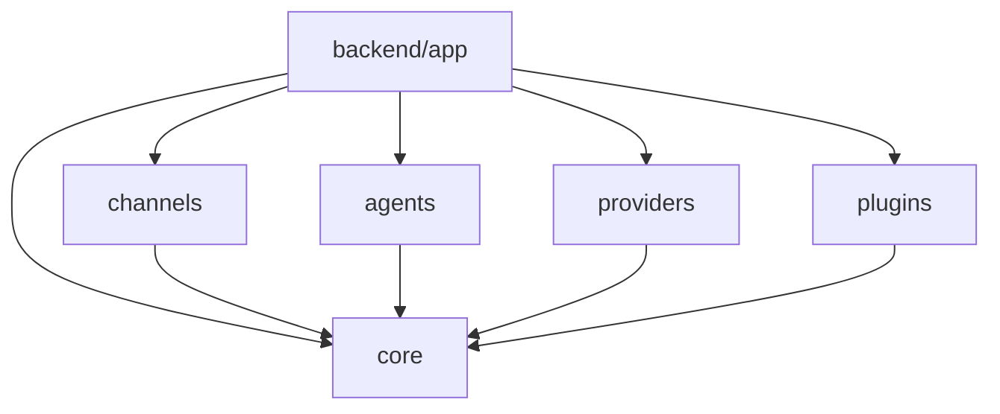
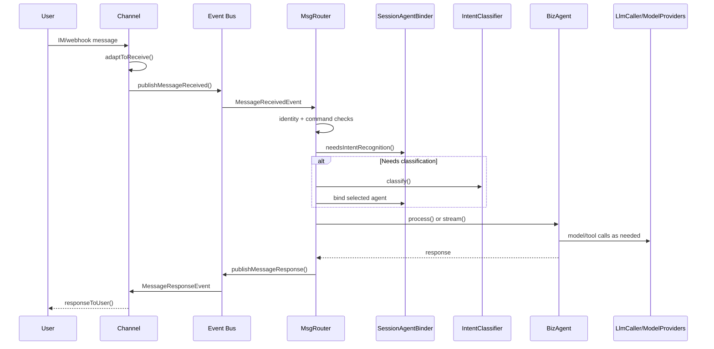

# JobClaw Architecture Reference

Source project: `F:\JobClaw`

Purpose: this note distills JobClaw's architecture into a reusable reference for future projects. It focuses on transferable design ideas, module boundaries, message flow, extension points, and tradeoffs, rather than on every implementation detail.

## 1. Architectural Positioning

JobClaw is best understood as an OpenClaw-style multi-agent runtime for job-search scenarios, not as a single job crawler or job-listing web app.

The key architectural idea is:

```text
External IM channels
  -> unified channel/message adapter
  -> event bus
  -> conversation router
  -> intent classifier
  -> session-agent binder
  -> business agent
  -> model/tool/provider layer
  -> channel response
```

This gives the system a "replaceable capability" shape:

- Channels are replaceable: WeChat, DingDing, FeiShu, and future webhook/chat channels.
- Agents are replaceable: identity collection, job fetching, job recommendation, task planning, preferences, fallback chat.
- Providers are replaceable: OpenAI-compatible, Zhipu, Ali Bailian, Anthropic, and future model backends.
- Tools are replaceable: Playwright, job-library search, MCP tools, task tools, checklist tools.
- Storage can evolve: local files/H2 in development, MySQL and richer infrastructure in production.

For a future project, the most reusable concept is the separation between the agent runtime kernel and domain-specific agents.

## 2. Module Map

Current Maven/module layout:

```text
JobClaw/
|-- backend/       Spring Boot assembly app and web/admin/job-data domains
|-- core/          shared agent runtime kernel
|-- channels/      external IM/channel adapters
|-- agents/        independent business agents
|-- providers/     LLM provider integrations
|-- plugins/       tool capabilities
|-- ui-react/      Next.js frontend
|-- docs/          project documentation
|-- docker/        local/dev/prod deployment assets
`-- workspace/     runtime data: conversations, users, H2 DB, files
```

Recommended responsibility boundaries:

| Area | Owns | Should not own |
| --- | --- | --- |
| `core/` | Agent contracts, router, event bus, model abstraction, memory, tools, task abstractions, common API models | Concrete job-search business workflows |
| `channels/` | External channel protocol adaptation and response delivery | Business intent logic |
| `agents/` | Conversational business capabilities | Channel-specific parsing, provider-specific model code |
| `providers/` | Model construction from provider config | Business prompts, routing, memory |
| `plugins/` | Tool implementations callable by agents/models | Agent orchestration policy |
| `backend/` | Spring Boot composition, web/admin domains, job-data CRUD/workflows | Shared runtime abstractions that other modules need |
| `ui-react/` | Admin/user frontend | Backend orchestration logic |

Dependency principle:

```text
backend
  -> channels
  -> agents
  -> providers
  -> plugins
  -> core

channels/agents/providers/plugins -> core
core -> no business module
```

## 3. Runtime Layering

JobClaw can be described as eight layers:

1. Channel ingress layer
   External IM/webhook adapters receive messages.

2. Message adapter layer
   Channel-specific payloads become `ChannelReceiveMessage`.

3. Event bus layer
   `ChannelEventPublisher` publishes received/response events and decouples channel code from agent code.

4. Conversation management layer
   `MsgRouter` coordinates identity initialization, system commands, intent classification, agent routing, and fallback.

5. Business agent layer
   `BizAgent` implementations handle domain capabilities.

6. Model layer
   `LlmCaller` and `ModelProviders` resolve user/global model preferences and call specific providers.

7. Tool/plugin layer
   Tools such as Playwright, job search, MCP, task tools, and checklist tools extend what models/agents can do.

8. Response egress layer
   `MessageResponseEvent` is routed back to the originating `Channel`, which sends it to the external user.

## 4. Core Message Flow

The central flow lives around `AbsChannel`, `ChannelEventPublisher`, and `MsgRouter`:

```text
IM message arrives
  |
  v
AbsChannel.processMessage()
  -> adaptToReceive()
  -> ChannelReceiveMessage
  -> reportToAgent()
  |
  v
ChannelEventPublisher.publishMessageReceived()
  -> MessageReceivedEvent
  |
  v
MsgRouter.onMessageReceived()
  1. Build UserConversationInfo
  2. Trigger identity/profile initialization when needed
  3. Execute system command if message is /help, /agents, /current, /agent, /plan, /reset, etc.
  4. Support direct agent command form such as /{agentId}
  5. Ask SessionAgentBinder whether intent recognition is needed
  6. Classify intent through CompositeIntentClassifier
  7. Route through AgentRouter
  8. Bind session to selected agent when starting a new session
  9. Execute BizAgent.process() or BizAgent.stream()
  10. Fallback to LlmCaller if agent cannot handle or throws
  |
  v
ChannelEventPublisher.publishMessageResponse()
  -> MessageResponseEvent
  |
  v
MsgRouter.onMessageResponse()
  -> ChannelRegistry.getChannel()
  -> Channel.responseToUser()
```

Design value:

- Channels know how to talk to IM platforms.
- Router knows how to pick the right agent.
- Agents know how to solve domain tasks.
- Providers know how to construct model clients.
- Tools know how to perform external actions.

These pieces stay independent enough to be replaced.

## 5. Key Core Abstractions

| Abstraction | Role |
| --- | --- |
| `Channel` | External channel interface: receive/report/respond. |
| `AbsChannel` | Base implementation for message adaptation, heartbeat, event publishing, and auto-start. |
| `ChannelRegistry` | Finds channels and response builders. |
| `ChannelReceiveMessage` | Normalized inbound message model. |
| `ChannelResponseMessage` | Normalized outbound response model. |
| `ChannelEventPublisher` | Event bus adapter for inbound/outbound channel events. |
| `BizAgent` | Business-agent contract: permission, intro, supported intents, process, stream, priority, availability. |
| `AbsBizAgent` | Base class for LLM-backed agents and memory/tool integration. |
| `IIdentityAgent` | Profile/identity initialization hook triggered before normal routing. |
| `MsgRouter` | Central conversation router and orchestration point. |
| `SystemCommandDispatcher` | Handles slash commands separately from business intent classification. |
| `IntentClassifier` | Classifies user messages into agent intents. |
| `AgentRouter` | Maps classified intent/current session state to a selected agent. |
| `SessionAgentBinder` | Persists conversation-to-agent binding to avoid repeated reclassification. |
| `AgentRegistry` | Discovers and retrieves registered `BizAgent` beans. |
| `LlmCaller` | Unified sync/stream model-call abstraction. |
| `ModelProviders` | Resolves `provider#modelName` user/global preferences into Spring AI `Model` instances. |
| `ModelProvider` | Provider-specific model factory. |
| `AutoDiscoveredTool` | Tool/plugin discovery contract. |
| `TaskManager` | User-isolated scheduled/recurring task orchestration. |

## 6. Agent Design

All conversational business capabilities should be modeled as `BizAgent`.

A good JobClaw-style agent should:

- expose a stable `AgentIntro` with globally unique `agentId`;
- declare permissions through `AgentPermission`;
- declare supported intents when it is not a general fallback agent;
- implement both sync and streaming behavior where useful;
- use `LlmCaller` instead of binding directly to one model vendor;
- register tools through established tool/plugin mechanisms;
- leave channel-specific details to `channels/`;
- leave provider-specific details to `providers/`;
- keep memory interaction through core memory abstractions.

Existing agent categories:

| Agent category | Example implementation area | Responsibility |
| --- | --- | --- |
| Identity/profile agent | `agents/identity-collector-agent` | Builds user profile files such as soul, identity, and info. |
| Job fetch agent | `agents/job-fetch-agent` | Extracts and normalizes job information from text, files, images, URLs, and crawled pages. |
| Job recommend agent | `agents/job-recommend-agent` | Matches user profile/interests against job data. |
| Preference agent | `core/agent/impl/PreferenceSettingBizAgent` | Lets users configure model/API/preferences through conversation. |
| Task agent | `core/agent/impl/TaskBizAgent` | Creates one-off or recurring reminders/tasks. |
| Plan agent | `core/agent/impl/PlanBizAgent` | Plan/checklist style assistance. |
| Fallback chat | `CustomChatBizAgent`, `SimpleDefaultBizAgent` | General conversation fallback. |

## 7. Intent Routing Pattern

JobClaw uses a hybrid routing pattern:

```text
System command match
  -> direct command execution

Direct /{agentId} command
  -> explicit agent route

Existing session binding
  -> continue current agent unless recognition is needed

Composite intent classification
  -> keyword and/or LLM classification
  -> AgentRouter
  -> SessionAgentBinder.bind()
```

Why this is useful:

- Fast commands avoid unnecessary model calls.
- User-directed agent switching stays deterministic.
- Session binding avoids jitter where every message may route to a different agent.
- LLM classification handles ambiguous natural-language requests.
- Fallback to a default agent keeps the UX forgiving.

For a new project, this pattern is worth copying almost directly.

## 8. Model Provider Pattern

Models are selected by user/global preference strings:

```text
provider#modelName
```

Example:

```text
zhipu#glm-4.7
openai#gpt-4.1
anthropic#claude-...
```

`ModelProviders` does the following:

1. loads the user's AI preference;
2. falls back to the global/default preference when needed;
3. parses `provider#modelName`;
4. finds provider config and model metadata;
5. checks required model type such as text, vision, image, embedding, ASR, or TTS;
6. constructs/caches the model through the matching `ModelProvider`.

Transferable principle:

Business agents should request "a text/vision/etc. model for this user", not "the Zhipu/OpenAI client". This keeps provider migration and per-user model selection out of business code.

## 9. Memory and User Profile Pattern

JobClaw separates short conversation memory from durable user profile.

Runtime conversation memory:

- stored under `workspace/conversations/{userId}/`;
- serialized as YAML;
- managed through file-system repositories and smart context windows;
- can be summarized/archived to control context length.

Durable user profile:

- stored under `workspace/users/{userId}/`;
- generated/updated by identity collection;
- split into multiple conceptual files.

Profile layers:

| Layer | Purpose |
| --- | --- |
| Soul | Personality, values, aspirations, preferences. |
| Identity | Skills, education, work/project experience, target direction. |
| Info | Basic demographic/context metadata. |

Design value:

- The runtime can keep recent chat lightweight.
- Agents can load stable user facts without replaying all conversations.
- Profile extraction can run automatically and asynchronously.
- Future recommendation/personalization has a durable substrate.

## 10. Tool and Plugin Pattern

Tools live outside agent logic when possible.

Examples:

- `plugins/playwright`: browser automation and JS-rendered page extraction.
- `plugins/job-library`: job data search over the backend job library.
- `core/tools/McpTool`: MCP tool integration.
- `core/tools/TaskTool`: task creation/management.
- `core/tools/CheckListTool`: plan/checklist support.

Transferable design:

```text
Agent decides what capability is needed
  -> core/tool registry exposes tools
  -> plugin implements external action
  -> model or agent invokes tool through standard abstraction
```

This prevents a business agent from turning into a pile of HTTP/browser/file code.

## 11. Backend Domain Split

`backend/` is not the agent runtime kernel. It is the Spring Boot composition layer plus web/admin/job-data domains.

Important backend areas:

| Area | Responsibility |
| --- | --- |
| `agents/` | LangGraph4J job-data workflow chain such as classify, gather, wash, publish. |
| `gather/` | AI-powered job collection pipeline. |
| `oc/` | Job info CRUD, drafts, MCP endpoints. |
| `user/` | User accounts, login, membership, payments. |
| `configs/` | Global dictionaries and environment configuration. |
| `openapi/` | Cross-platform account integration. |
| `components/` | Async utilities, ID generation, environment processing. |
| `web/` | Controllers, interceptors, response wrappers. |

Pattern:

```text
dao/entity
  -> dao/repository
  -> service
  -> convert/BO/DTO
  -> web/controller
```

For future projects, keep "runtime kernel" and "admin/business web app" separate even if they ship in the same Spring Boot application.

## 12. Frontend Shape

`ui-react/` is a Next.js 15 + React 19 static-export frontend using TailwindCSS and shadcn/ui.

It is mainly an admin/user companion for:

- job data management;
- drafts;
- users;
- coupons/dictionaries;
- channel configuration;
- personal/user pages.

Design note for future projects:

The primary user interaction for JobClaw is IM chat, not the web UI. The frontend should therefore be treated as an operations/admin companion unless the new project makes the browser the main product surface.

## 13. Deployment and Runtime Data

Local/dev defaults are intentionally lightweight:

- H2 for dev;
- MySQL for test/prod or Docker;
- optional Redis/Elasticsearch/Kafka/MinIO disabled unless needed;
- local file workspace for conversations, profiles, uploads, and tasks.

Runtime workspace layout:

```text
workspace/
|-- datas/                  H2 database files
|-- users/{userId}/          profile files
|-- conversations/{userId}/  chat session YAML
|-- tasks/{userId}/          scheduled/recurring task data
`-- storage/                 uploaded/generated files
```

This is good for fast iteration. A larger production system can later replace pieces with durable infrastructure.

## 14. What To Reuse In A Future Project

Strongly reusable:

1. The module split: `core`, `channels`, `agents`, `providers`, `plugins`, `backend`, `ui`.
2. The normalized channel message model.
3. Event-bus decoupling between channels and agents.
4. Central `MsgRouter` as a thin orchestrator.
5. `BizAgent` as the business capability interface.
6. System commands before LLM intent classification.
7. Session-agent binding to reduce routing drift.
8. Hybrid intent classification: command, keyword, LLM.
9. User/global model preference format: `provider#modelName`.
10. Provider abstraction and model cache.
11. Tool/plugin isolation from business agents.
12. File-based memory/profile store for early-stage development.
13. Runtime data separation by user ID.
14. Keep web/admin domains outside the agent kernel.

Reuse with adaptation:

1. JobClaw's job-search domain agents should become domain agents for the new project.
2. Soul/Identity/Info profile layers may need different names and schemas.
3. IM-first UX may not fit a browser-first product.
4. File-based persistence is fine for local/dev, but production may need database/object storage.
5. LangGraph4J workflows are useful for complex multi-step jobs, but not every agent needs graph orchestration.
6. The fallback-to-LLM policy should be tuned for safety-sensitive domains.

Avoid blindly copying:

1. Job-specific package names and prompt assumptions.
2. Any API keys, local workspace data, H2 database files, or channel credentials.
3. Optional middleware unless the new project actually needs it.
4. Complex tool discovery before there are enough tools to justify it.
5. Large domain workflows inside `backend` when they belong as independent agents.

## 15. Suggested Blueprint For A New Project

If using JobClaw as a starting design reference, begin with this minimum architecture:

```text
new-project/
|-- app/ or backend/          Spring Boot application assembly
|-- core/                     agent runtime kernel
|   |-- channel/
|   |-- bus/
|   |-- router/
|   |-- agent/
|   |-- providers/
|   |-- tools/
|   `-- memory/
|-- channels/
|   `-- web-or-im-channel/
|-- agents/
|   |-- profile-agent/
|   |-- domain-task-agent/
|   `-- default-chat-agent/
|-- providers/
|   |-- openai-compatible/
|   `-- local-or-other-provider/
|-- plugins/
|   `-- domain-tool/
`-- ui/
```

Build in this order:

1. Define normalized inbound/outbound message models.
2. Implement one channel and one default agent.
3. Add event publisher and router.
4. Add provider abstraction and one model provider.
5. Add session-agent binding.
6. Add system commands.
7. Add keyword intent classification.
8. Add LLM intent classification only after the route map stabilizes.
9. Add domain agents one by one.
10. Add tools/plugins only when agents have real external actions to perform.
11. Add user profile/memory once repeated interactions need personalization.
12. Add admin UI after backend operations need visibility.

## 16. Design Checklist

Use this checklist when designing the future project:

- What are the external channels?
- What is the normalized message shape?
- Which component owns routing?
- What are the first 3-5 business agents?
- Which intents map to which agents?
- How does a user explicitly switch agents?
- How long should a session stay bound to an agent?
- What is the default/fallback agent?
- What model types are needed: text, vision, embedding, image, ASR, TTS?
- How are provider credentials configured?
- Which tools should be plugins rather than agent code?
- What user profile facts are durable?
- What conversation memory is short-term only?
- What is local-dev storage, and what is production storage?
- Which admin screens are genuinely needed?
- What should be intentionally left out for the first version?

## 17. High-Level Diagrams

Module dependency:



Message flow:



## 18. One-Sentence Summary

JobClaw's most valuable architectural lesson is to treat an AI product as a modular agent runtime: channels adapt messages, the core routes conversations, agents own business capabilities, providers own model integration, plugins own tools, and the app layer only assembles the system.
