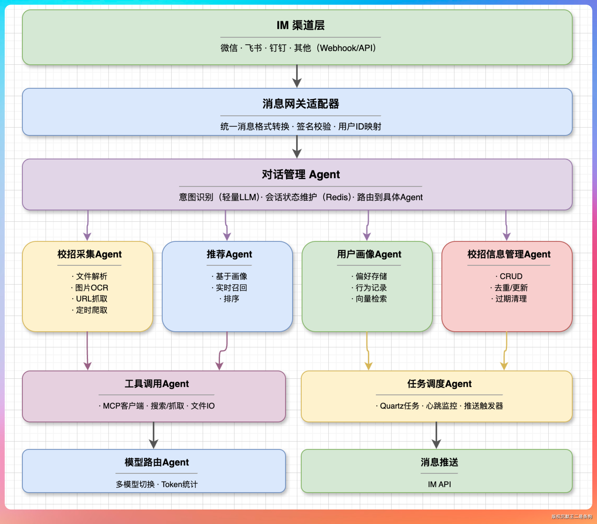

# JobClaw（求职派）

JobClaw 是一个面向求职场景的 OpenClaw 风格多 Agent 实战项目。它不再只是“校招信息采集、解析、展示”应用，而是把 IM Channel、消息路由、意图识别、Agent 注册、模型 Provider、工具 Plugin、用户画像和职位数据业务拆成可替换模块，形成一个可以本地运行、可以二次开发的 Java AI Agent 工程。

## 当前架构



```text
IM 渠道层
  -> 消息网关适配器
  -> 对话管理 Agent
  -> 业务 Agent
  -> 工具调用 Agent / 模型路由 Agent / 任务调度 Agent
  -> 消息推送
```

核心思路：

- `channels/`：把微信、钉钉、飞书等入口统一成 `ChannelReceiveMessage`。
- `core/`：提供 Agent/Channel 抽象、事件总线、对话管理、路由、会话绑定、意图识别、模型选择、记忆和任务能力。
- `agents/`：承载可插拔业务 Agent，例如身份采集、岗位抓取、岗位推荐。
- `providers/`：隔离智谱、OpenAI 兼容、阿里、Anthropic 等模型接入。
- `plugins/`：提供 Playwright、职位库检索等工具能力。
- `app/`：组装所有模块，并保留 Web 管理、职位库、草稿、用户、支付、MCP Server 等应用域。

更完整的当前架构说明见 [求职派 OpenClaw 式多 Agent 架构总览](docs/03、架构篇/00-✅求职派OpenClaw式多Agent架构总览.md)。

## 技术栈

- Java 21
- Spring Boot 4.0.5
- Spring AI 2.0.0-M4
- Spring Modulith
- LangGraph4J
- JPA / Hibernate
- H2 / MySQL
- React 19 / Next.js 15 / TailwindCSS / shadcn/ui

## 模块结构

```text
JobClaw/
├── app/                     # Spring Boot 主应用，组装所有模块
├── core/                    # Agent Runtime 核心抽象、路由、事件、模型、记忆
├── channels/                # 微信、钉钉、飞书等消息入口
├── providers/               # 大模型 Provider 接入
├── plugins/                 # 工具插件
├── agents/                  # 业务 Agent
├── ui-react/                # Next.js 前端
└── docs/                    # 项目文档与语雀导出资料
```

## 后端启动

首次启动建议参考 [JobClaw 首次启动指南](docs/getting-started.md)。

```bash
cp .env.example .env
cp workspace/datas/jobclaw.mv.db workspace/datas/jobclaw-my.mv.db
# 在 .env 中设置 JOBCLAW_DATABASE_NAME=jobclaw-my，并配置 ZHIPU_API_KEY

./mvnw spring-boot:run -pl app
```

默认访问地址：`http://localhost:8087`

常用命令：

```bash
./mvnw clean package -DskipTests
./mvnw test
./mvnw test -Dtest=ExcelLoadTest
```

## 前端启动

```bash
cd ui-react
pnpm install
pnpm dev
pnpm build
pnpm run deploy
```

`pnpm run deploy` 会把静态产物复制到 `app/src/main/resources/static/`。

## IM 系统命令

- `/help`：查看帮助
- `/agents`：查看可用 Agent
- `/current`：查看当前会话绑定的 Agent
- `/agent <agentId>`：切换 Agent
- `/reset`：重置会话

## 文档

- [首次启动指南](docs/getting-started.md)
- [OpenClaw 式多 Agent 架构总览](docs/03、架构篇/00-✅求职派OpenClaw式多Agent架构总览.md)
- [语雀知识库导出目录](docs/yuque-export-index.md)
- [迭代计划](docs/plan.md)
